# AstroSessionOrganizer
[Version française](README.md)

***AstroSessionOrganizer*** (**ASO**) is a free ***Windows*** tool for managing and backing up your astrophotography observing sessions and their related data.

The software is available in **FR** and **EN**.

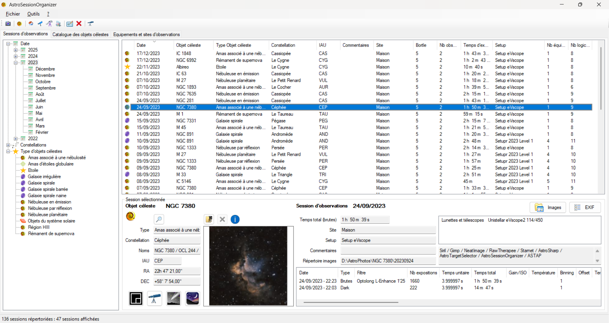

> [!NOTE]
> The screenshots in this documentation show the French version of the interface.

## Table of contents
- [Display](#display)
    - [Menu](#menu)
        - [File menu](#file-menu)
        - [Tools menu](#tools-menu)
            - [Options](#options-dialog)
        - [? menu](#-menu)
           - [About](#about-dialog)
           - [New version available](#new-version-available-dialog)
    - [Toolbar](#toolbar)
    - [Tabs](#tabs)
        - [Observing sessions tab](#observing-sessions-tab)
            - [Observing session detail panel](#observing-session-detail-panel)
            - [Create an Exif dialog](#create-an-exif-dialog)
        - [Celestial objects catalogue tab](#celestial-objects-catalogue-tab)
            - [Celestial objects filter area](#celestial-objects-filter-area)
            - [Celestial object detail panel](#celestial-object-detail-panel)
        - [Equipment and observing sites tab](#equipment-and-observing-sites-tab)
            - [Site or equipment properties panel](#site-or-equipment-properties-panel)
                - [Observing site properties](#observing-site-properties)
                - [Setup properties](#setup-properties)
                - [Refractor / telescope properties](#refractor--telescope-properties)
                - [Mount properties](#mount-properties)
                - [Camera properties](#camera-properties)
                - [Filter properties](#filter-properties)
                - [Miscellaneous equipment properties](#miscellaneous-equipment-properties)
                - [Software properties](#software-properties)
    - [Status bar](#status-bar)
        - [Observing sessions tab status bar](#observing-sessions-tab-status-bar)
        - [Celestial objects catalogue tab status bar](#celestial-objects-catalogue-tab-status-bar)
        - [Equipment and observing sites tab status bar](#equipment-and-observing-sites-tab-status-bar)
- [Data entry](#data-entry)
    - [Observing session](#observing-session)
        - [Add, edit, delete an observing session](#add-edit-delete-an-observing-session)
        - [Celestial object selection](#celestial-object-selection)
            - [Celestial object selection dialog](#celestial-object-selection-dialog)
        - [Observing session date](#observing-session-date)
        - [Observing site selection](#observing-site-selection)
        - [Session images folder selection](#session-images-folder-selection)
        - [Session comments](#session-comments)
        - [Equipment entry](#equipment-entry)
            - [Setup selection](#setup-selection)
            - [Additional equipment selection](#additional-equipment-selection)
            - [Session equipment list](#session-equipment-list)
        - [Software entry](#software-entry)
            - [Add/remove software for the session](#addremove-software-for-the-session)
        - [Session observations entry](#session-observations-entry)
            - [Add/edit an observation](#addedit-an-observation)
            - [Import information from a FIT file](#import-information-from-a-fit-file)
    - [Celestial object](#celestial-object)
        - [Add, edit, delete a celestial object](#add-edit-delete-a-celestial-object)
    - [Observing site](#observing-site)
        - [Add, edit, delete an observing site](#add-edit-delete-an-observing-site)
    - [Setup](#setup)
        - [Add, edit, delete a setup](#add-edit-delete-a-setup)
        - [Edit a setup](#edit-a-setup)
    - [Equipment](#equipment)
        - [Add, edit, delete equipment](#add-edit-delete-equipment)
        - [Edit equipment](#edit-equipment)
    - [Software](#software)
        - [Add, edit, delete software](#add-edit-delete-software)
        - [Edit software](#edit-software)
- [Revisions](#revisions)

## Display
**ASO** is made of a menu, a toolbar, three tabs and a status bar.

<a href="#table-of-contents">Back to table of contents</a>

### Menu
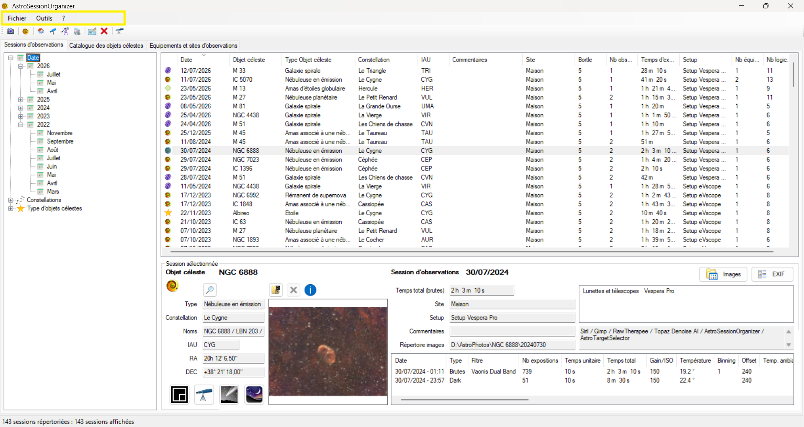

The menu contains the following items:
- File
- Tools
- ?

<a href="#table-of-contents">Back to table of contents</a>

#### File menu
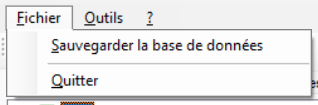

The ***File*** menu contains the following items:
- **Back up the database**\
Backs up the **ASO** database.

> [!WARNING]
> The database backup **does not include** the images of your observing sessions, except the images generated by ***ASO***. The database contains the information about your sessions, celestial objects, equipment and observing sites.

- **Quit**\
Closes **ASO**.

<a href="#table-of-contents">Back to table of contents</a>

#### Tools menu
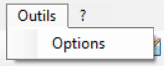

The ***Tools*** menu contains the following item:
- **Options**\
Opens the ***Options*** dialog.

<a href="#table-of-contents">Back to table of contents</a>

##### Options dialog
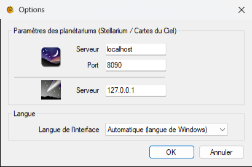

This dialog sets the connection options for ***Stellarium*** and ***Cartes du Ciel***, as well as the interface language.\
The default options are:
- ***Stellarium***:
    - Server   : **localhost**
    - Port     : **8090**
- ***Cartes du Ciel***:
    - Server   : **127.0.0.1**
- **Interface language**: **Automatic (Windows language)**

The interface language can be:
- **Automatic (Windows language)**: **ASO** is displayed in French if Windows is in French, and in English for every other language.
- **Français**
- **English**

> [!NOTE]
> The language change takes effect the next time **ASO** starts.

<a href="#table-of-contents">Back to table of contents</a>

#### ? menu
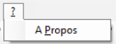

The ***?*** menu contains the following item:
- **About**\
Opens the ***About*** dialog.

<a href="#table-of-contents">Back to table of contents</a>

##### About dialog
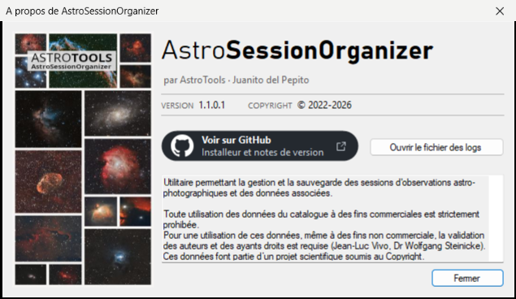

This dialog shows information about ***AstroSessionOrganizer*** (***ASO***): version, copyright and terms of use of the catalogue data.\
The **View on GitHub** button opens this page in your browser: you will find the latest version and what's new there.\
The **Open the log file** button opens the application log file.

<a href="#table-of-contents">Back to table of contents</a>

##### New version available dialog
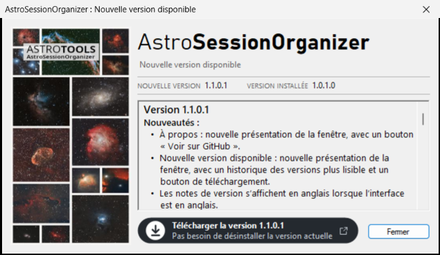

At startup, ***ASO*** checks whether a new version is available. If so, this dialog opens:
- The **New version** / **Installed version** line compares the published version with the one installed on your PC.
- The list shows what's new and the fixes of all published versions; the version installed on your PC is marked *installed version*.
- The **Download version …** button opens the installer download link in your browser, then closes ***ASO*** so as not to disturb the installation. Then run the downloaded installer: no need to uninstall the current version, and your data and settings are kept.
- The **Close** button closes the dialog without updating: ***ASO*** will offer the update again at the next startup.

<a href="#table-of-contents">Back to table of contents</a>

### Toolbar
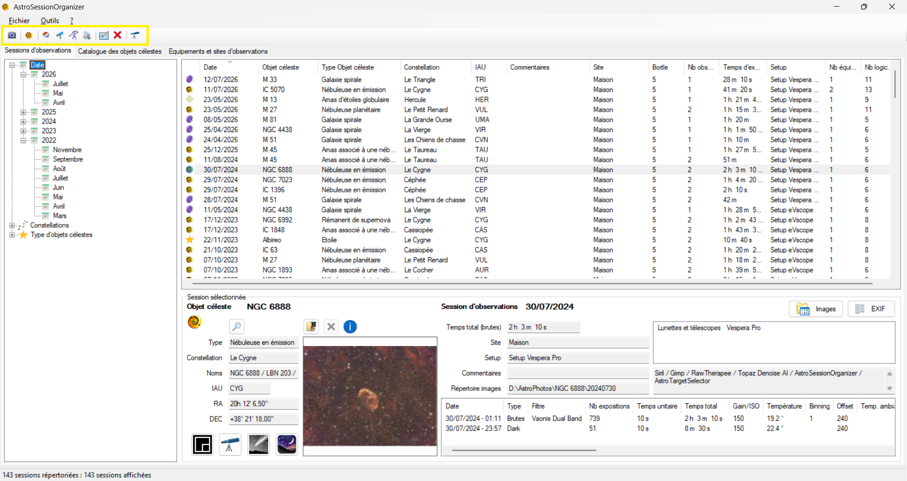

The toolbar provides shortcuts to the following actions:
- New observing session
- New celestial object
- New observing site
- New setup
- New equipment
- New software
- Edit the selected item
- Delete the selected item
- Shortcut to the ***[AstroTargetSelector](https://github.com/Juani005999/AstroTargetSelector)*** (***ATS***) application

> [!NOTE]
> These actions are described in the ***[Data entry](#data-entry)*** section.

<a href="#table-of-contents">Back to table of contents</a>

### Tabs
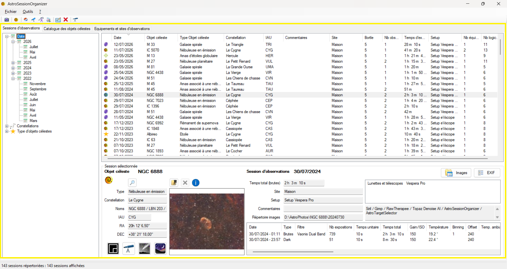

This area contains the following tabs:
- Observing sessions.
- Celestial objects catalogue.
- Equipment and observing sites.

<a href="#table-of-contents">Back to table of contents</a>

#### Observing sessions tab
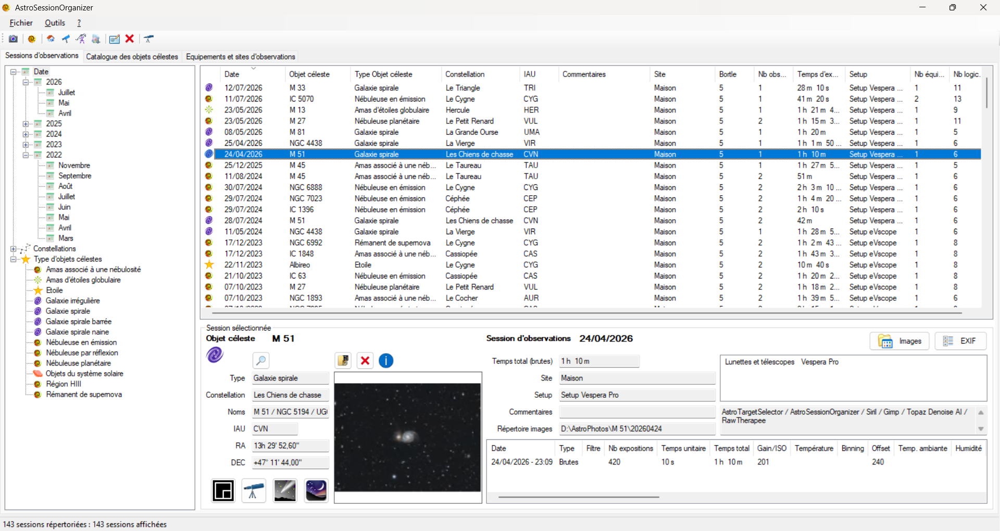

This tab shows the list of recorded observing sessions.\
It is divided into three parts:
- A tree containing the following items:
    - ***Date***\
    All the years/months of the sessions in the database.
    - ***Constellations***\
    The constellations of the sessions in the database.
    - ***Celestial object types***\
    The celestial object types of the sessions in the database.
- A main list showing the sessions matching the item selected in the tree.
- A panel showing the details of the selected session.

> [!TIP]
> The session list can be sorted in ascending or descending order by clicking a column header.

<a href="#table-of-contents">Back to table of contents</a>

##### Observing session detail panel
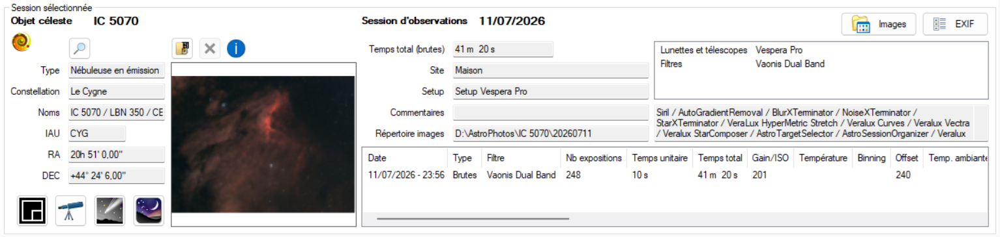

When an observing session is selected in the list, the session detail panel appears.\
This panel shows the information about the selected session and gives access to additional actions on it.

Information shown:
- About the celestial object of the session:
    - Thumbnail of the final image.\
    By default, the image used is the first one in the session images folder.
    - Name.
    - Type.
    - Other designations.
    - Constellation.
    - RA/DEC coordinates.
- About the session:
    - Date.
    - Total time (computed from the lights added to the session).
    - Observing site.
    - Setup used (if set for the session).
    - Comments.
    - Folder containing the session images.
    - List of the equipment used.
    - List of the software used for processing.
    - List of the observations (lights, darks, ...).

Available actions:
- Clicking the session thumbnail shows the image in a new window.
- The 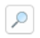 icon is a shortcut that shows the celestial object directly in the ***[Celestial objects catalogue](#celestial-objects-catalogue-tab)*** tab.
- The 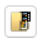 icon changes the session image shown in the thumbnail.
- When an image has been selected for the session thumbnail, the 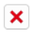 icon removes this selection. The default image is used again.\
When no image has been selected, this button is greyed out.
- The 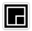 icon starts ***ASTAP*** to plate solve the session image.\
When you click this button, a dialog lets you choose the image to send to ***ASTAP***. By default, it opens the images folder set for the session.\
If ***ASTAP*** is not installed on the computer, this button is greyed out.
- The 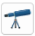 icon shows the session object in ***[AstroTargetSelector](https://github.com/Juani005999/AstroTargetSelector)***.\
When you click this button, ***[AstroTargetSelector](https://github.com/Juani005999/AstroTargetSelector)*** opens with the session object selected.\
If ***[AstroTargetSelector](https://github.com/Juani005999/AstroTargetSelector)*** is not installed on the computer, this button is greyed out.
- The 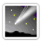 icon shows the session object in ***Cartes du Ciel***.\
When you click this button, ***Cartes du Ciel*** opens with the session object selected.\
If ***Cartes du Ciel*** is not installed on the computer, this button is greyed out.
- The 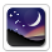 icon shows the session object in ***Stellarium***.\
When you click this button, ***Stellarium*** opens with the session object selected.\
If ***Stellarium*** is not installed on the computer, this button is greyed out.
- The 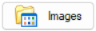 icon opens the session images folder.\
This folder is set in the session settings (see [Observing session entry](#observing-session)).
- The 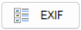 icon opens the dialog for creating an Exif for the session (see [Create an Exif dialog](#create-an-exif-dialog)).

<a href="#table-of-contents">Back to table of contents</a>

##### Create an Exif dialog
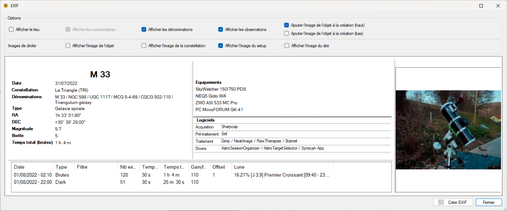
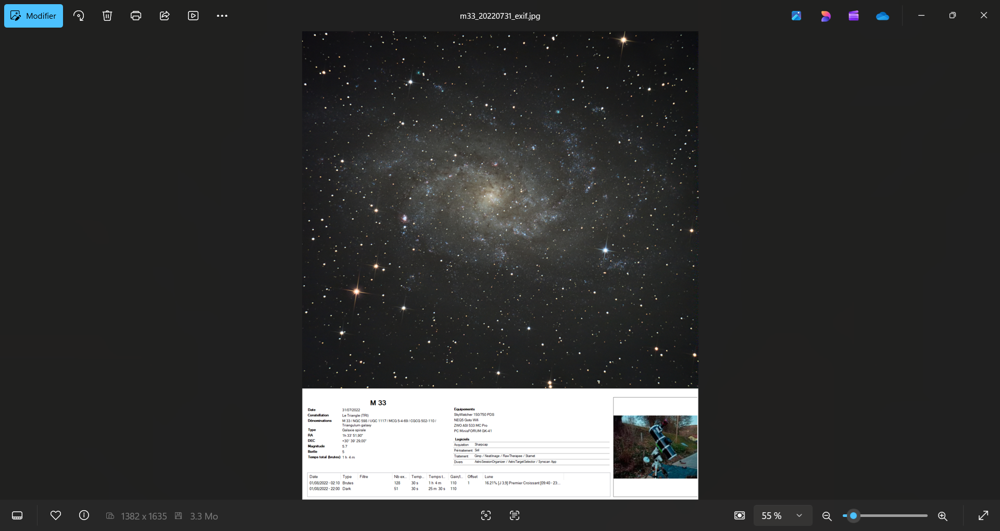

This dialog creates an Exif for the observing session.\
It contains a settings area and a preview area.

The settings area contains the following items:
- ***Show location***: shows the GPS coordinates of the observing site.
- ***Show comments***: shows the session comments. If no comment was entered for the session, this option is greyed out.
- ***Show designations***: shows the other designations of the celestial object.
- ***Show observations***: shows the list of the session observations.
- ***Add the object image on creation (top / bottom)***: when the Exif is created, adds the session image either above or below the Exif data.

The right-hand area of the Exif data can show up to four images:
- ***Show the object image***: shows a thumbnail of the session image.
- ***Show the constellation image***: shows a thumbnail of the constellation of the celestial object.
- ***Show the setup image***: shows the image of the setup selected for the session.
- ***Show the site image***: shows the image of the observing site.

> [!TIP]
> You can change the look of the Exif data by resizing each area.\
When you hover over the ***grey bars***, you can click and drag them to resize each area.\
Resizing the window, especially its height, also adjusts the final Exif.

<a href="#table-of-contents">Back to table of contents</a>

#### Celestial objects catalogue tab
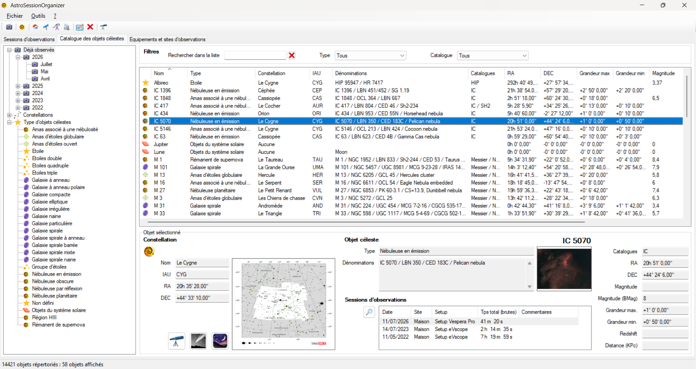

This tab shows the list of celestial objects in the catalogue.\
It is divided into four parts:
- A tree containing the following items:
    - ***Already observed***\
    All the years/months of the catalogue objects already observed.
    - ***Constellations***\
    The constellations of all the catalogue objects.
    - ***Celestial object types***\
    The celestial object types of all the catalogue objects.
- A [search area](#celestial-objects-filter-area) to filter the list of celestial objects.
- A main list showing the celestial objects matching the item selected in the tree and the filters applied.
- A panel showing the details of the selected celestial object.

> [!TIP]
> The celestial object list can be sorted in ascending or descending order by clicking a column header.

<a href="#table-of-contents">Back to table of contents</a>

##### Celestial objects filter area
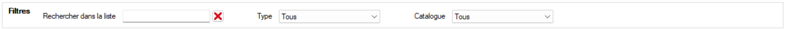

The search area used to filter the list of celestial objects contains the following filters:
- ***Search in the list***: searches the name and/or the designations.
- ***Type***: filters the list by celestial object type.
- ***Catalogue***: filters on a catalogue (Messier, NGC, ...).

<a href="#table-of-contents">Back to table of contents</a>

##### Celestial object detail panel
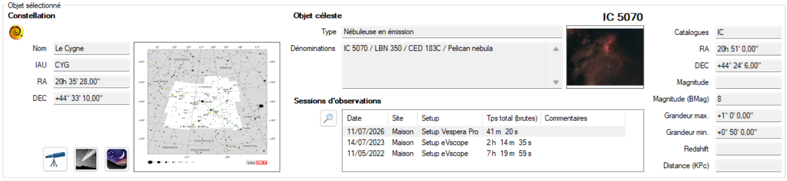

When a celestial object is selected in the list, the object detail panel appears.\
This panel shows the information about the celestial object and its observing sessions, and gives access to additional actions.

Information shown:
- About the celestial object:
    - Thumbnail of the object's constellation.
    - Name.
    - Type.
    - Other designations.
    - Constellation.
    - RA/DEC coordinates.
    - Catalogue.
    - Magnitude.
    - Magnitude (BMag).
    - Max. size.
    - Min. size.
    - Redshift.
    - Distance (kpc).
    - List of the observing sessions on the celestial object.
    - Thumbnail of the session selected in the list of sessions on the object.

Available actions:
- Clicking the constellation thumbnail shows the image in a new window.
- Clicking the thumbnail of the selected session shows the image in a new window.
- The  icon is a shortcut that shows the observing session directly in the ***[Observing sessions](#observing-sessions-tab)*** tab.
- The  icon shows the celestial object in ***[AstroTargetSelector](https://github.com/Juani005999/AstroTargetSelector)***.\
When you click this button, ***[AstroTargetSelector](https://github.com/Juani005999/AstroTargetSelector)*** opens with the celestial object selected.\
If ***[AstroTargetSelector](https://github.com/Juani005999/AstroTargetSelector)*** is not installed on the computer, this button is greyed out.
- The  icon shows the celestial object in ***Cartes du Ciel***.\
When you click this button, ***Cartes du Ciel*** opens with the celestial object selected.\
If ***Cartes du Ciel*** is not installed on the computer, this button is greyed out.
- The  icon shows the celestial object in ***Stellarium***.\
When you click this button, ***Stellarium*** opens with the celestial object selected.\
If ***Stellarium*** is not installed on the computer, this button is greyed out.

<a href="#table-of-contents">Back to table of contents</a>

#### Equipment and observing sites tab
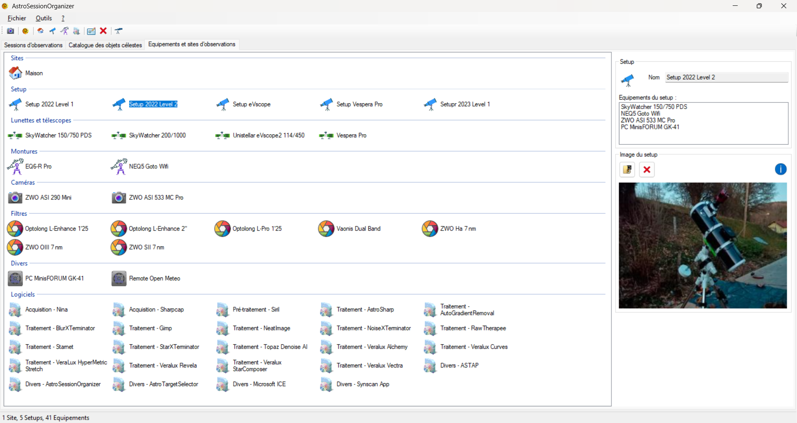

This tab shows the observing sites and the equipment.\
It is divided into two parts:
- A list of observing sites and equipment with eight groups:
    - ***Sites***: observing sites.
    - ***Setup***: setups.
    - ***Refractors and telescopes***: refractors and telescopes.
    - ***Mounts***: mounts.
    - ***Cameras***: cameras and DSLRs.
    - ***Filters***: filters.
    - ***Miscellaneous***: miscellaneous equipment.
    - ***Software***: software used for image acquisition, management and processing.\
    This group contains four software categories:
        - ***Acquisition***.
        - ***Pre-processing***.
        - ***Processing***.
        - ***Miscellaneous***.
- A panel showing the properties of the selected item.

> [!TIP]
> Setups are optional: they group several pieces of equipment to make entering an observing session easier.

<a href="#table-of-contents">Back to table of contents</a>

##### Site or equipment properties panel

This panel shows the properties of the item selected in the list.

###### Observing site properties
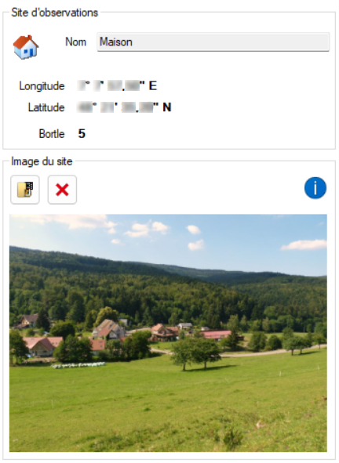

This panel shows the properties of the selected site and lets you set an image for the site.

Information shown:
- Name.
- GPS coordinates.
- Bortle scale.
- Thumbnail of the site image.

> [!TIP]
> Clicking the site thumbnail shows the image in a new window.

<a href="#table-of-contents">Back to table of contents</a>

###### Setup properties
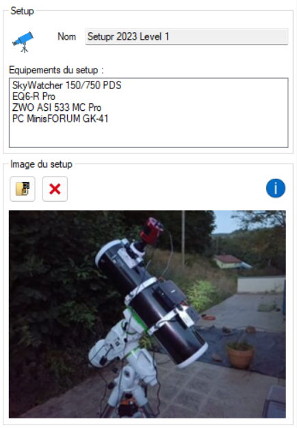

This panel shows the properties of the selected setup and lets you set an image for the setup.

Information shown:
- Name.
- List of the equipment in the setup.
- Setup thumbnail.

> [!TIP]
> Setups are optional: they group several pieces of equipment to make entering an observing session easier.\
A setup also lets you show a thumbnail in the Exifs.\
Clicking the setup thumbnail shows the image in a new window.

<a href="#table-of-contents">Back to table of contents</a>

###### Refractor / telescope properties
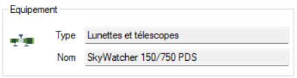

This panel shows the properties of the selected refractor or telescope.

Information shown:
- Name.
- Equipment type.

<a href="#table-of-contents">Back to table of contents</a>

###### Mount properties
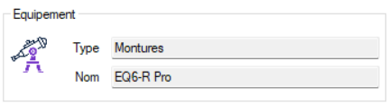

This panel shows the properties of the selected mount.

Information shown:
- Name.
- Equipment type.

<a href="#table-of-contents">Back to table of contents</a>

###### Camera properties
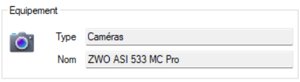

This panel shows the properties of the selected camera.

Information shown:
- Name.
- Equipment type.

<a href="#table-of-contents">Back to table of contents</a>

###### Filter properties
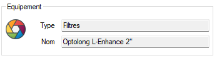

This panel shows the properties of the selected filter.

Information shown:
- Name.
- Equipment type.

<a href="#table-of-contents">Back to table of contents</a>

###### Miscellaneous equipment properties
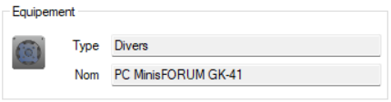

This panel shows the properties of the selected equipment.

Information shown:
- Name.
- Equipment type.

<a href="#table-of-contents">Back to table of contents</a>

###### Software properties
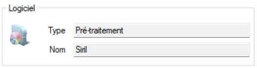

This panel shows the properties of the selected software.

Information shown:
- Name.
- Software type.

<a href="#table-of-contents">Back to table of contents</a>

### Status bar
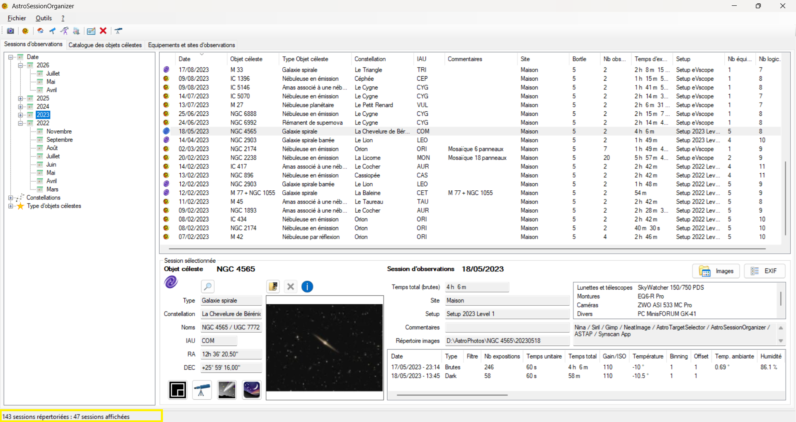

The status bar shows additional information depending on the tab displayed.

#### Observing sessions tab status bar
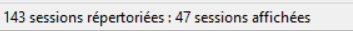

When the [Observing sessions](#observing-sessions-tab) tab is displayed, the status bar shows:
- The total number of recorded observing sessions.
- The number of observing sessions displayed in the session list.

> [!NOTE]
> The number of observing sessions displayed in the list depends on the item selected in the tree.

<a href="#table-of-contents">Back to table of contents</a>

#### Celestial objects catalogue tab status bar
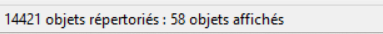

When the [Celestial objects catalogue](#celestial-objects-catalogue-tab) tab is displayed, the status bar shows:
- The total number of celestial objects listed in the catalogue.
- The number of celestial objects displayed in the object list.

> [!NOTE]
> The number of celestial objects displayed in the list depends on the item selected in the tree and on the filters set in the filter area.

<a href="#table-of-contents">Back to table of contents</a>

#### Equipment and observing sites tab status bar
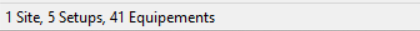

When the [Equipment and observing sites](#equipment-and-observing-sites-tab) tab is displayed, the status bar shows:
- The number of recorded observing sites.
- The number of recorded setups.
- The number of recorded pieces of equipment.

<a href="#table-of-contents">Back to table of contents</a>

## Data entry

### Observing session
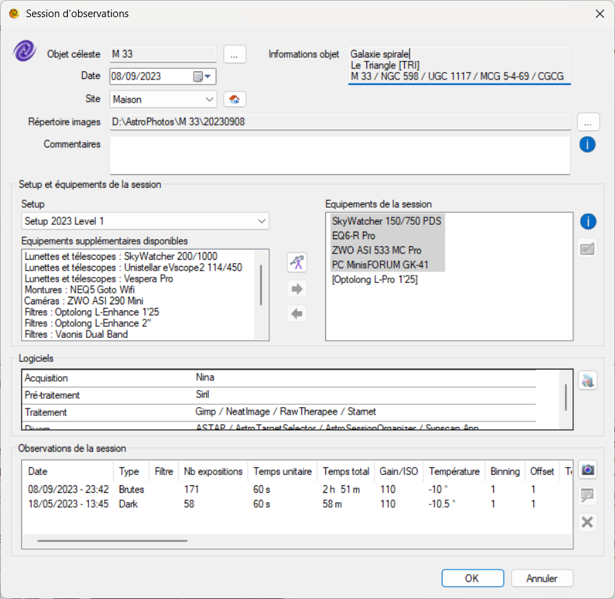

This dialog is used to enter or edit an observing session.

<a href="#table-of-contents">Back to table of contents</a>

#### Add, edit, delete an observing session

You can add, edit or delete an observing session:
- From the toolbar:
    - The 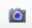 button opens the dialog for creating a new session.
    - The 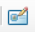 button edits the selected session.\
    If no session is selected, this button is greyed out.
    - The 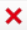 button deletes the selected session.\
    If no session is selected, this button is greyed out.

- From the context menu:\
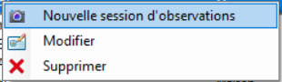\
In the [Observing sessions tab](#observing-sessions-tab), right-click the list of observing sessions to open the context menu.\
This context menu contains the following items:
    - ***New observing session***: opens the dialog for creating a new session.
    - ***Edit***: edits the selected session.\
    If no session is selected, this item is greyed out.
    - ***Delete***: deletes the selected session.\
    If no session is selected, this item is greyed out.

<a href="#table-of-contents">Back to table of contents</a>

#### Celestial object selection

- The field below shows the name of the celestial object currently selected for the observing session.\
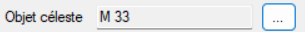
\
The 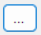 button opens the [celestial object selection dialog](#celestial-object-selection-dialog).

- The area below shows additional information about the selected celestial object.\
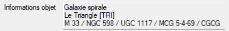\
This information is:
    - Object type.
    - Constellation name and abbreviation.
    - Other designations of the object.

<a href="#table-of-contents">Back to table of contents</a>

##### Celestial object selection dialog
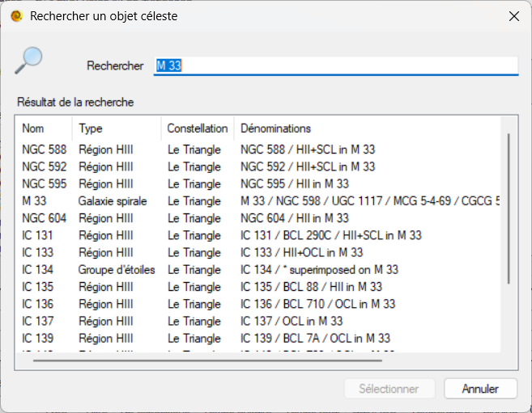

This dialog selects a celestial object for the session.\
It has two areas:
- ***Search***: field where you type what you are looking for.
- ***Search results***: objects of the complete catalogue that match your search.

> [!NOTE]
> - The search results are updated as you type in the search field.
> - At least three characters are needed to start the search.
> - The search covers the name and the designations.

<a href="#table-of-contents">Back to table of contents</a>

#### Observing session date
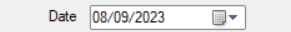

This field selects the date of the observing session.

<a href="#table-of-contents">Back to table of contents</a>

#### Observing site selection

The area below selects the observing site of the session.

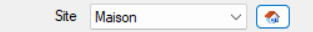

The  button opens the dialog for creating a new observing site.

> [!NOTE]
> The new site will then appear in your list of [observing sites](#equipment-and-observing-sites-tab).

<a href="#table-of-contents">Back to table of contents</a>

#### Session images folder selection

The area below selects the folder containing the session images.

The  button selects the folder containing the session images.

> [!TIP]
> Personally, I store the images of my astro sessions on an external hard drive, in a folder named `AstroPhotos`.\
Here is the pattern I use to store my images:\
`D:\AstroPhotos\[Object name]\[Session date]\`

<a href="#table-of-contents">Back to table of contents</a>

#### Session comments

The area below lets you enter a comment for the session.

<a href="#table-of-contents">Back to table of contents</a>

#### Equipment entry

##### Setup selection

The area below selects the [Setup](#setup-properties).

> [!TIP]
> Selecting a Setup is **optional**.\
> You can select the equipment manually, or combine a Setup with additional equipment for the session.

<a href="#table-of-contents">Back to table of contents</a>

##### Additional equipment selection

The area below adds extra equipment to your session.

> [!IMPORTANT]
> The equipment belonging to the selected Setup is removed from this list, as well as the additional equipment already selected.

> [!NOTE]
> To add an item from the additional equipment list to the session equipment list, select the equipment and click the green arrow (pointing right), or double-click the equipment.

> [!TIP]
> If a piece of equipment is not in the list yet, you can create it by clicking the  button.\
> The new equipment will then appear in your [equipment list](#equipment-and-observing-sites-tab).

<a href="#table-of-contents">Back to table of contents</a>

##### Session equipment list

The area below lists the equipment currently selected for your observing session.

> [!NOTE]
> To remove an item from the session equipment list, select the equipment and click the red arrow (pointing left), or double-click the equipment.

> [!TIP]
> Equipment belonging to the selected Setup has a grey background.

> [!IMPORTANT]
> Equipment belonging to the selected Setup cannot be removed from the list.

> [!NOTE]
> You can give a different name to the selected equipment (except equipment belonging to the selected Setup).\
> Example: ***Guiding: SW Evoguide ED50***.\
> To do so, select the equipment and click the  button.\
> To restore the default name, delete the text and leave the field empty.

> [!NOTE]
> When the default name is used for a piece of equipment (except equipment belonging to the selected Setup), it is shown between [ ].

<a href="#table-of-contents">Back to table of contents</a>

#### Software entry

The area below lists the software selected for your observing session.

> [!NOTE]
> You can add/remove software for your session by clicking the  button.

<a href="#table-of-contents">Back to table of contents</a>

##### Add/remove software for the session

The area below lists the software currently selected for your observing session.

- The left-hand list shows the other available software.
- The right-hand list shows the software currently selected for the session.

> [!TIP]
> Software is divided into four groups:
> - Acquisition.
> - Pre-processing.
> - Processing.
> - Miscellaneous.

> [!NOTE]
> To move software from one list to the other, select it and click the matching arrow.\
> You can also double-click software to move it from one list to the other.

> [!TIP]
> If some software is not in the list yet, you can create it by clicking the  button.\
> The new software will then appear in your [equipment list](#equipment-and-observing-sites-tab).

<a href="#table-of-contents">Back to table of contents</a>

#### Session observations entry

The area below lists the observations of your observing session.

> [!NOTE]
> The  button adds a new observation.\
> The  button edits an observation.\
> The  button deletes an observation.

<a href="#table-of-contents">Back to table of contents</a>

##### Add/edit an observation

Observations are added or edited with the dialog below.

This dialog is used to enter all the information about the observation.

> [!TIP]
> Moon information is filled in automatically from the date and time of the observation.\
> You can still change it if you wish.

> [!NOTE]
> The following observation types are available:
> - Lights
> - Darks
> - Bias / Offset
> - Flats

##### Import information from a FIT file

To make data entry easier, you can import the observation information from a FIT file.

- Click the ***Open a file*** button to select the FIT file whose headers (observation information in standard format) will be read.

> [!TIP]
> Personally, I select the ***[MyTarget]_stacked.fit*** file produced by stacking in ***Siril***.

- Click the ***Import*** button to fill in the observation with the information from the FIT file headers.

<a href="#table-of-contents">Back to table of contents</a>

### Celestial object

<a href="#table-of-contents">Back to table of contents</a>

#### Add, edit, delete a celestial object

You can add, edit or delete a celestial object:
- From the toolbar:
    - The  button opens the dialog for creating a new celestial object.
    - The  button edits the selected object.\
    If no object is selected, this button is greyed out.
    - The  button deletes the selected object.\
    If no object is selected, this button is greyed out.

- From the context menu:\
\
In the [Celestial objects catalogue tab](#celestial-objects-catalogue-tab), right-click the list of celestial objects to open the context menu.\
This context menu contains the following items:
    - ***New celestial object***: opens the dialog for creating a new object.
    - ***Edit***: edits the selected object.\
    If no object is selected, this item is greyed out.
    - ***Delete***: deletes the selected object.\
    If no object is selected, this item is greyed out.

> [!IMPORTANT]
> Celestial objects from the original catalogue cannot be edited or deleted.
> Only objects added manually can be edited.

<a href="#table-of-contents">Back to table of contents</a>

### Observing site

<a href="#table-of-contents">Back to table of contents</a>

#### Add, edit, delete an observing site

You can add, edit or delete an observing site:
- From the toolbar:
    - The  button opens the dialog for creating a new observing site.
    - The  button edits the selected site, setup, equipment or software.\
    If no item is selected, this button is greyed out.
    - The  button deletes the selected site, setup, equipment or software.\
    If no item is selected, this button is greyed out.

- From the context menu:\
\
In the [Equipment and observing sites tab](#equipment-and-observing-sites-tab), right-click the list of equipment and observing sites to open the context menu.\
This context menu contains the following items:
    - ***New > Observing site***: opens the dialog for creating an observing site.
    - ***Edit***: edits the selected site.\
    If no item is selected, this item is greyed out.
    - ***Delete***: deletes the selected site.\
    If no item is selected, this item is greyed out.

<a href="#table-of-contents">Back to table of contents</a>

### Setup

A setup groups several pieces of equipment to make it easier to enter observing sessions done with the same equipment.

> [!NOTE]
> Setups are optional.

<a href="#table-of-contents">Back to table of contents</a>

#### Add, edit, delete a setup

You can add, edit or delete a setup:
- From the toolbar:
    - The  button opens the dialog for creating a new setup.
    - The  button edits the selected site, setup, equipment or software.\
    If no item is selected, this button is greyed out.
    - The  button deletes the selected site, setup, equipment or software.\
    If no item is selected, this button is greyed out.

- From the context menu:\
\
In the [Equipment and observing sites tab](#equipment-and-observing-sites-tab), right-click the list of equipment and observing sites to open the context menu.\
This context menu contains the following items:
    - ***New > Setup***: opens the dialog for creating a setup.
    - ***Edit***: edits the selected setup.\
    If no item is selected, this item is greyed out.
    - ***Delete***: deletes the selected setup.\
    If no item is selected, this item is greyed out.

<a href="#table-of-contents">Back to table of contents</a>

#### Edit a setup

The setup dialog lets you name the setup and select the equipment it contains.

> [!NOTE]
> - To add an item from the available equipment list to the setup equipment list, select the equipment and click the green arrow (pointing right), or double-click the equipment.
> - To remove an item from the setup equipment list, select the equipment and click the red arrow (pointing left), or double-click the equipment.

> [!TIP]
> You can give a different name to the equipment added to the setup.\
> Example: ***Guiding: SW Evoguide ED50***.\
> To do so, select the equipment and click the  button.\
> - To restore the default name, delete the text and leave the field empty.
> - When the default name is used for a piece of equipment (except equipment belonging to the selected Setup), it is shown between [ ].

<a href="#table-of-contents">Back to table of contents</a>

### Equipment

<a href="#table-of-contents">Back to table of contents</a>

#### Add, edit, delete equipment

You can add, edit or delete equipment:
- From the toolbar:
    - The  button opens the dialog for creating new equipment.
    - The  button edits the selected site, setup, equipment or software.\
    If no item is selected, this button is greyed out.
    - The  button deletes the selected site, setup, equipment or software.\
    If no item is selected, this button is greyed out.

- From the context menu:\
\
In the [Equipment and observing sites tab](#equipment-and-observing-sites-tab), right-click the list of equipment and observing sites to open the context menu.\
This context menu contains the following items:
    - ***New > Equipment***: opens the dialog for creating equipment.
    - ***Edit***: edits the selected equipment.\
    If no item is selected, this item is greyed out.
    - ***Delete***: deletes the selected equipment.\
    If no item is selected, this item is greyed out.

<a href="#table-of-contents">Back to table of contents</a>

#### Edit equipment

The equipment dialog lets you select an equipment type and give the equipment a name.

> [!NOTE]
> There are five equipment types:
>
> 
> - Refractors and telescopes
> - Mounts
> - Cameras
> - Filters
> - Miscellaneous

<a href="#table-of-contents">Back to table of contents</a>

### Software

<a href="#table-of-contents">Back to table of contents</a>

#### Add, edit, delete software

You can add, edit or delete software:
- From the toolbar:
    - The  button opens the dialog for creating new software.
    - The  button edits the selected site, setup, equipment or software.\
    If no item is selected, this button is greyed out.
    - The  button deletes the selected site, setup, equipment or software.\
    If no item is selected, this button is greyed out.

- From the context menu:\
\
In the [Equipment and observing sites tab](#equipment-and-observing-sites-tab), right-click the list of equipment and observing sites to open the context menu.\
This context menu contains the following items:
    - ***New > Software***: opens the dialog for creating software.
    - ***Edit***: edits the selected software.\
    If no item is selected, this item is greyed out.
    - ***Delete***: deletes the selected software.\
    If no item is selected, this item is greyed out.

<a href="#table-of-contents">Back to table of contents</a>

#### Edit software

The software dialog lets you select a software type and give the software a name.

> [!NOTE]
> There are four software types:
>
> 
> - Acquisition
> - Pre-processing
> - Processing
> - Miscellaneous

<a href="#table-of-contents">Back to table of contents</a>

## Revisions

| Date | Version | Comments |
| --- | --- | --- |
| 10/10/2026 | 1.1.0.1 | <ul><li>About: new window layout, with a “View on GitHub” button.</li><li>New version available: new window layout, with an easier-to-read version history and a download button.</li><li>Release notes are shown in English when the interface is in English.</li><li>Technical libraries update.</li></ul> |
| 04/10/2026 | 1.0.1.0 | <ul><li>AstroSessionOrganizer is available in English. The language follows Windows (French on a French Windows, English otherwise) and can be chosen in Options → Language.</li><li>Database update (English labels for types and constellations), with no data loss.</li><li>Technical libraries update.</li></ul> |
| 04/10/2026 | 0.9.0.4 | <ul><li>About: link to the AstroSessionOrganizer GitHub page (installer, what's new).</li><li>Your settings (window, columns, Exifs…) are now kept when updating.</li><li>Updates are now checked from GitHub.</li><li>Technical libraries update.</li></ul> |
| 27/09/2026 | 0.9.0.3 | <ul><li>Internal technical update (dependencies). No visible change.</li></ul> |
| 20/09/2026 | 0.9.0.2 | <ul><li>Fix for the missing Caldwell catalogue. Thanks to Eric Beurnaux :)</li></ul> |
| 16/08/2026 | 0.8.2.1 | <ul><li>Exifs: fix in the display of the observations table columns.</li></ul> |
| 14/05/2023 | 0.8.1.1 | <ul><li>Weather data: new observation fields to store the data of your weather station (OpenWeather, ROM, ...). Ambient temperature, humidity, atmospheric pressure, dew point, star FWHM, sky quality (SQM), sky temperature, sky brightness.</li></ul> |
| 19/03/2023 | 0.7.1.1 | <ul><li>webp images: support for images in webp format.</li></ul> |
| 05/03/2023 | 0.5.6.2 | <ul><li>Database backup: the success message box is replaced by an icon notification.</li></ul> |
| 16/02/2023 | 0.5.5.2 | <ul><li>Exif improvements: Exif settings are saved. Well spotted Gaël Ajinn :)</li></ul> |
| 14/02/2023 | 0.5.4.2 | <ul><li>Exif improvements: Moon information removed for observations that are not 'lights'.</li></ul> |
| 14/02/2023 | 0.5.4.1 | <ul><li>Exif improvements: the celestial object image can be added in large size at the bottom of the Exif (Thanks Gaël Ajinn).</li></ul> |
| 11/02/2023 | 0.5.3.4 | <ul><li>FITS information import: after checking and validation with the SIRIL team, the DATE-OBS field is read in UTC (Coordinated Universal Time).</li></ul> |
| 09/02/2023 | 0.5.3.2 | <ul><li>Session creation: the new session is automatically selected in the list after creation.</li><li>Designations: the celestial object designations are shown in the Exifs and in the session details.</li></ul> |
| 05/02/2023 | 0.5.3.1 | <ul><li>FITS information import: the data read with the FITS reader can be loaded into an observation.</li></ul> |
| 04/02/2023 | 0.5.2.1 | <ul><li>Observations: the 'Moon' field is updated automatically from the date and place of the observation.</li></ul> |
| 01/02/2023 | 0.4.1.0 | <ul><li>Observations: new 'Offset/Brightness' field for observations.</li><li>Database change: the structure of the Observations table is modified.</li></ul> |
| 01/02/2023 | 0.4.0.3 | <ul><li>FIT Header reader: fix for reading COMMENT fields in the Header Data Unit.</li><li>Observations dialog: cosmetic changes.</li></ul> |
| 31/01/2023 | 0.4.0.2 | <ul><li>FIT Header reader: when creating/editing an observation, a FIT header reader lets you view the HDU data of a fit/fits image.</li></ul> |
| 31/01/2023 | 0.4.0.1 | <ul><li>Constellation image: when creating/editing a session, the constellation image is automatically copied into the session images folder.</li><li>Communication with [AstroTargetSelector](https://github.com/Juani005999/AstroTargetSelector): the object designations are sent.</li><li>Opening in Stellarium: Stellarium is brought to the foreground when an object is shown.</li><li>Opening in Cartes du Ciel: Cartes du Ciel is brought to the foreground when an object is shown.</li><li>Session display: the RA/DEC of the session's celestial object is shown.</li></ul> |
| 28/01/2023 | 0.3.0.1 | <ul><li>Communication with [AstroTargetSelector](https://github.com/Juani005999/AstroTargetSelector): a catalogue object can be shown to see how its altitude changes in the sky and the maximum exposure time.</li><li>Database change: the celestial objects table is updated.</li></ul> |
| 01/01/2023 | 0.1.0.1 | Initial version. |

<a href="#table-of-contents">Back to table of contents</a>

