# AstroSessionOrganizer
***AstroSessionOrganizer*** (**ASO**) est un utilitaire (freeware) sous ***Windows*** permettant la gestion et la sauvegarde des sessions d'observations astrophotographiques et des données associées.

## Sommaire
- [Affichage](#affichage)
    - [Menu](#menu)
        - [Menu Fichier](#menu-fichier)
        - [Menu Outils](#menu-outils)
            - [Options](#boîte-de-dialogue-options)
        - [Menu ?](#menu-)
           - [A Propos](#boîte-de-dialogue-a-propos)
    - [Barre d'outils](#barre-doutils)
    - [Onglets](#onglets)
        - [Onglet Sessions d'observations](#onglet-sessions-dobservations)
            - [Panneau détail d'une session d'observation](#panneau-détail-dune-session-dobservations)
            - [Boîte de dialogue Création d'un Exif](#boîte-de-dialogue-création-dun-exif)
        - [Onglet Catalogue des objets célestes](#onglet-catalogue-des-objets-célestes)
            - [Zone de filtres des objets célestes affichés](#zone-de-filtres-des-objets-célestes-affichés)
            - [Panneau détail d'un objet céleste](#panneau-détail-dun-objet-céleste)
        - [Onglet Equipements et sites d'observations](#onglet-equipements-et-sites-dobservations)
            - [Panneau propriétés d'un site ou d'un équipement](#panneau-propriétés-dun-site-ou-dun-équipement)
                - [Propriétés d'un site d'observations](#propriétés-dun-site-dobservations)
                - [Propriétés d'un setup](#propriétés-dun-setup)
                - [Propriétés d'une lunette / télescope](#propriétés-dune-lunette--télescope)
                - [Propriétés d'une monture](#propriétés-dune-monture)
                - [Propriétés d'une caméra](#propriétés-dune-caméra)
                - [Propriétés d'un filtre](#propriétés-dun-filtre)
                - [Propriétés d'un équipement divers](#propriétés-dun-équipement-divers)
                - [Propriétés d'un logiciel](#propriétés-dun-logiciel)
    - [Barre de statut](#barre-de-statut)
        - [Barre de statut de l'onglet Sessions d'observations](#barre-de-statut-de-longlet-sessions-dobservations)
        - [Barre de statut de l'onglet Catalogue des objets célestes](#barre-de-statut-de-longlet-catalogue-des-objets-célestes)
        - [Barre de statut de l'onglet Equipements et sites d'observations](#barre-de-statut-de-longlet-equipements-et-sites-dobservations)
- [Saisie](#saisie)
    - [Session d'observations](#session-dobservations)
        - [Ajout, modification, suppression d'une session d'observations](#ajout-modification-suppression-dune-session-dobservations)
        - [Sélection d'un objet céleste](#sélection-dun-objet-céleste)
            - [Boîte de dialogue de sélection d'un objet céleste](#boîte-de-dialogue-de-sélection-dun-objet-céleste)
        - [Date de la session d'observations](#date-de-la-session-dobservations)
        - [Sélection du site d'observations](#sélection-du-site-dobservations)
        - [Sélection du répertoire contenant les images de la session](#sélection-du-répertoire-contenant-les-images-de-la-session)
        - [Commentaires d'une session](#commentaires-dune-session)
        - [Saisie de l'équipement](#saisie-de-léquipement)
            - [Sélection d'un Setup](#sélection-dun-setup)
            - [Sélection d'équipements supplémentaires](#sélection-déquipements-supplémentaires)
            - [Liste des équipements de la session](#liste-des-équipements-de-la-session)
        - [Saisie des logiciels](#saisie-des-logiciels)
            - [Ajout/suppression de logiciels à la session](#ajoutsuppression-de-logiciels-à-la-session)
        - [Saisie des observations de la session](#saisie-des-observations-de-la-session)
            - [Ajout/modification d'une observation](#ajoutmodification-dune-observation)
            - [Importation des informations d'un fichier Fit](#importation-des-informations-dun-fichier-fit)
    - [Objet céleste](#objet-céleste)
        - [Ajout, modification, suppression d'un objet céleste](#ajout-modification-suppression-dun-objet-céleste)
    - [Site d'observations](#site-dobservations)
        - [Ajout, modification, suppression d'un site d'observations](#ajout-modification-suppression-dun-site-dobservations)
    - [Setup](#setup)
        - [Ajout, modification, suppression d'un setup](#ajout-modification-suppression-dun-setup)
        - [Edition d'un setup](#edition-dun-setup)
    - [Equipement](#equipement)
        - [Ajout, modification, suppression d'un équipement](#ajout-modification-suppression-dun-équipement)
        - [Edition d'un équipement](#edition-dun-équipement)
    - [Logiciel](#logiciel)
        - [Ajout, modification, suppression d'un logiciel](#ajout-modification-suppression-dun-logiciel)
        - [Edition d'un logiciel](#edition-dun-logiciel)
- [Révisions](#révisions)

## Affichage
**ASO** est composé d'un menu, d'une barre d'outils, de trois onglets de visualisation et d'une barre de statut.

<a href="#sommaire">Retour au sommaire</a>

### Menu
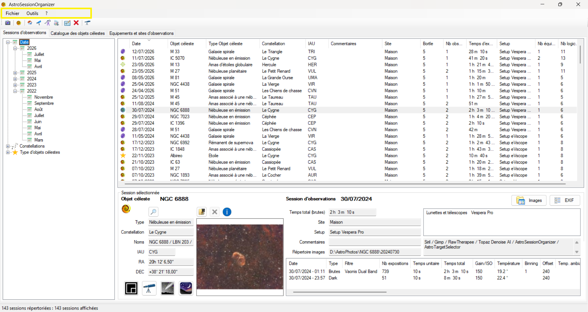

Le menu est constitué des éléments suivants :
- Fichier
- Outils
- ?

<a href="#sommaire">Retour au sommaire</a>

#### Menu 'Fichier'
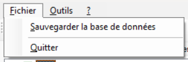

Le menu '***Fichier***' contient les éléments suivants :
- **Sauvegarder la base de données**\
Cette action permet de sauvegarder la base de données de **ASO**.

> [!WARNING]
> La sauvegarde de la base de données **ne comprend pas** les images des sessions d'observations, hormis les images générées par ***ASO***. La base de données contient les informations des sessions, des objets célestes, des équipements et sites d'observations.

- **Quitter**\
Permet de quitter l'application **ASO**.

<a href="#sommaire">Retour au sommaire</a>

#### Menu 'Outils'
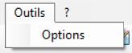

Le menu '***Outils***' contient l'élément suivant :
- **Options**\
Cette action permet d'ouvrir la boîte de dialogue ***Options***.

<a href="#sommaire">Retour au sommaire</a>

##### Boîte de dialogue 'Options'
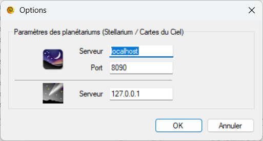

Cette boîte de dialogue permet de définir les options de communication avec les logiciels ***Stellarium*** et ***Cartes du Ciel***.\
Les Options par défaut sont :
- ***Stellarium*** :
    - Serveur   : **localhost**
    - Port      : **8090**
- ***Cartes du Ciel*** :
    - Serveur   : **127.0.0.1**

<a href="#sommaire">Retour au sommaire</a>

#### Menu '?'
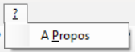

Le menu '***?***' contient l'élément suivant :
- **A Propos**\
Cette action permet d'ouvrir la boîte de dialogue ***A Propos***.

<a href="#sommaire">Retour au sommaire</a>

##### Boîte de dialogue 'A Propos'
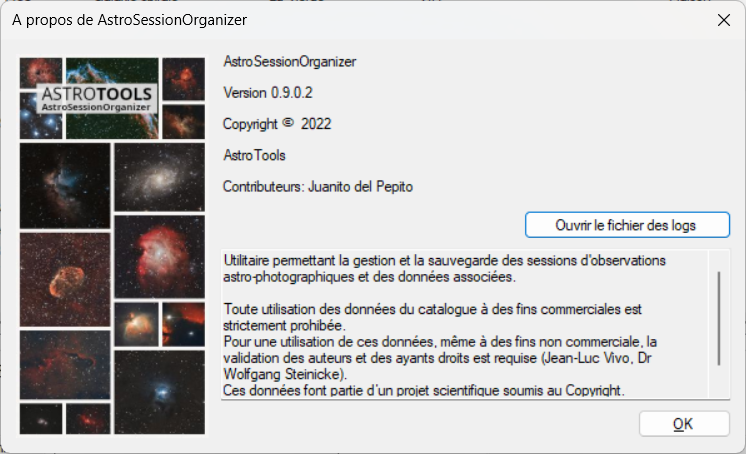

Cette boîte de dialogue permet d'afficher les informations à propos du logiciel ***AstroSessionOrganizer*** (***ASO***).\
Il est également possible, via le bouton présent, d'ouvrir le fichier des logs de l'application.

<a href="#sommaire">Retour au sommaire</a>

### Barre d'outils
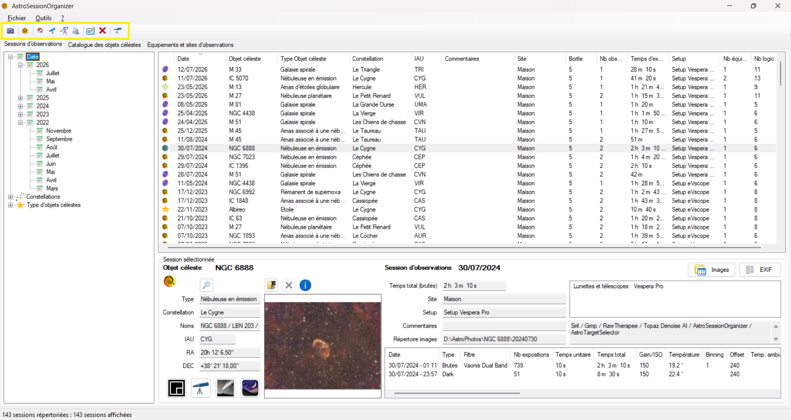

La barre d'outils comprend les raccourcis vers les actions suivantes :
- Nouvelle session d'observations
- Nouvel objet céleste
- Nouveau site d'observations
- Nouveau Setup
- Nouvel équipement
- Nouveau logiciel
- Modifier l'élément sélectionné
- Supprimer l'élément sélectionné
- Raccourci vers l'application ***[AstroTargetSelector](https://github.com/Juani005999/AstroTargetSelector)*** (***ATS***)

> [!NOTE]
> Le détail des actions ci-dessus est décrit dans la partie ***[Saisie](#saisie)***.

<a href="#sommaire">Retour au sommaire</a>

### Onglets
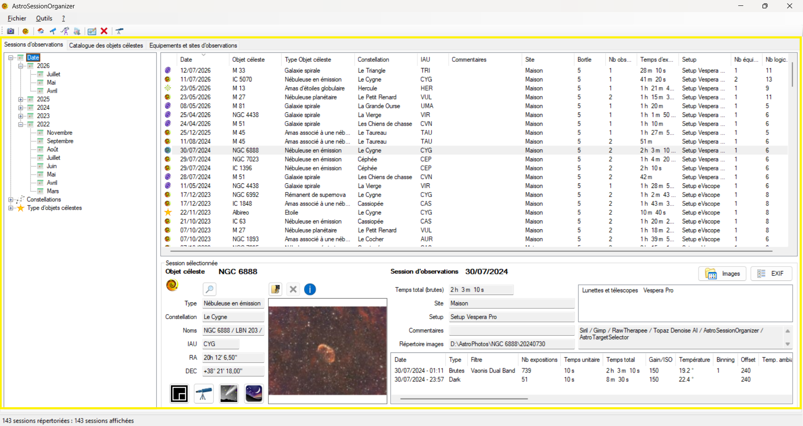

Cette partie comprend l'affichage des onglets suivants :
- Sessions d'observations.
- Catalogue des objets célestes.
- Equipements et sites d'observations.

<a href="#sommaire">Retour au sommaire</a>

#### Onglet Sessions d'observations
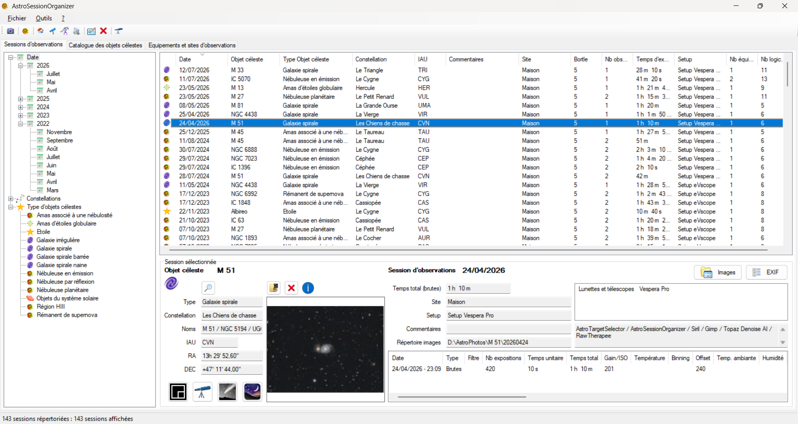

Cet onglet permet d'afficher la liste des sessions d'observations enregistrées.\
L'affichage de cet onglet est divisé en trois parties :
- Une liste arborescente comprenant les éléments :
    - ***Date***\
    Cet élément contient toutes les années/mois correspondant aux sessions présentes dans la base de données.
    - ***Constellations***\
    Cet élément contient la liste des constellations correspondant aux sessions présentes dans la base de données.
    - ***Type d'objets célestes***\
    Cet élément contient la liste des types d'objets célestes correspondant aux sessions présentes dans la base de données.
- Une liste principale contenant la liste des sessions en fonction de l'élément sélectionné dans la liste arborescente.
- Un panneau permettant d'afficher le détail d'une session sélectionnée.

> [!TIP]
> La liste des sessions peut être triée par ordre croissant ou décroissant en cliquant sur un en-tête de colonne de la liste.

<a href="#sommaire">Retour au sommaire</a>

##### Panneau détail d'une Session d'observations
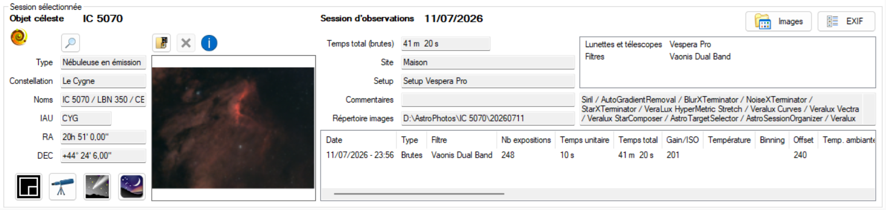

Lorsqu'une session d'observation est sélectionnée dans la liste, le panneau de détail de la session apparait.\
Ce panneau permet l'affichage des différentes informations concernant la session sélectionnée, et la possibilité d'effectuer des actions supplémentaires sur cette session.

Informations affichées :
- Informations de l'objet céleste concerné par la session :
    - Miniature de l'image finale.\
    Par défaut, l'image utilisée est la première du répertoire des images de la session.
    - Nom.
    - Type.
    - Dénominations secondaires.
    - Constellation.
    - Coordonnées en RA/DEC.
- Informations sur la session :
    - Date.
    - Temps total (calculé à partir des brutes ajoutées à la session).
    - Site d'observations.
    - Setup utilisé (si défini dans la session).
    - Commentaires.
    - Répertoire où se trouvent les images de la session.
    - Liste des équipements utilisés.
    - Liste des logiciels utilisés pour le traitement.
    - Liste des observations (brutes, darks, ...).

Actions possibles :
- En cliquant sur la miniature de la session, cela permet l'affichage de l'image dans une nouvelle fenêtre.
- L'icône  est un raccourci permettant d'afficher l'objet céleste concerné directement dans l'onglet ***[Catalogue des objets célestes](#onglet-catalogue-des-objets-célestes)***.
- L'icône 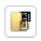 permet de modifier l'image de la session affichée dans la miniature.
- Lorsqu'une image pour la miniature de la session a été sélectionnée, l'icône  permet de supprimer cette sélection. L'image utilisée redevient l'image par défaut.\
Lorsqu'aucune image n'a été sélectionnée, ce bouton est grisé.
- L'icône  permet de lancer le logiciel ***ASTAP*** pour faire de l'astrométrie sur l'image de la session.\
Lors du clic sur ce bouton, une boîte de dialogue apparait permettant la sélection de l'image à envoyer dans l'astrométrie ***ASTAP***. Par défaut, le répertoire sélectionné pour la sélection de l'image est le répertoire des images saisi pour la session.\
Si le logiciel ***ASTAP*** n'est pas installé sur l'ordinateur, ce bouton est grisé.
- L'icône 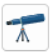 permet de visualiser l'objet de la session dans le logiciel ***[AstroTargetSelector](https://github.com/Juani005999/AstroTargetSelector)***.\
Lors du clic sur ce bouton, le logiciel ***[AstroTargetSelector](https://github.com/Juani005999/AstroTargetSelector)*** s'ouvre avec l'objet de la session présélectionné.\
Si le logiciel ***[AstroTargetSelector](https://github.com/Juani005999/AstroTargetSelector)*** n'est pas installé sur l'ordinateur, ce bouton est grisé.
- L'icône 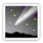 permet de visualiser l'objet de la session dans le logiciel ***Cartes du Ciel***.\
Lors du clic sur ce bouton, le logiciel ***Cartes du Ciel*** s'ouvre avec l'objet de la session présélectionné.\
Si le logiciel ***Cartes du Ciel*** n'est pas installé sur l'ordinateur, ce bouton est grisé.
- L'icône  permet de visualiser l'objet de la session dans le logiciel ***Stellarium***.\
Lors du clic sur ce bouton, le logiciel ***Stellarium*** s'ouvre avec l'objet de la session présélectionné.\
Si le logiciel ***Stellarium*** n'est pas installé sur l'ordinateur, ce bouton est grisé.
- L'icône 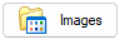 permet d'ouvrir le répertoire des images de la session.\
Ce répertoire est défini dans les paramètres de la session (Cf. partie [Saisie d'une session](#session-dobservations)).
- L'icône 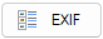 permet d'ouvrir la boîte de dialogue permettant la création d'un Exif pour la session (Cf. partie [Boîte de dialogue Création d'un Exif de session](#boîte-de-dialogue-création-dun-exif)).

<a href="#sommaire">Retour au sommaire</a>

##### Boîte de dialogue Création d'un Exif
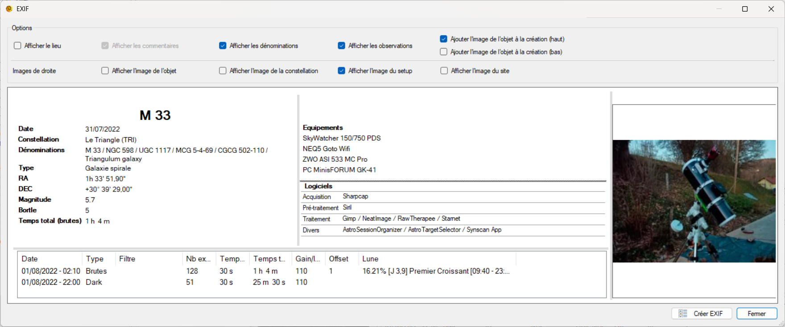
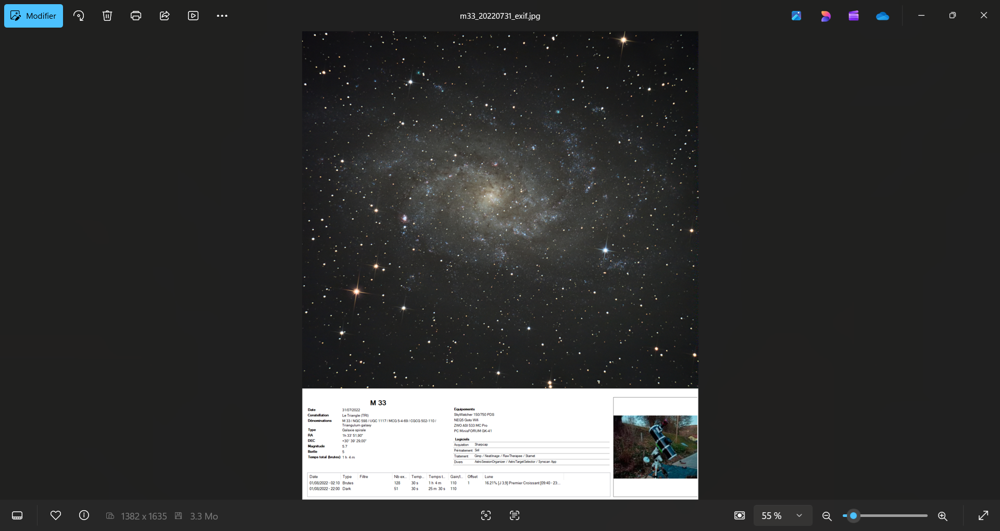

Cette boîte de dialogue permet la création d'un Exif pour la session d'observations.\
Elle contient une zone de paramètres, et une zone de rendu.

La zone de paramètres contient les éléments suivants :
- ***Afficher le lieu*** : affiche les coordonnées GPS du site d'observations.
- ***Afficher les commentaires*** : affiche les commentaires de la session. Si aucun commentaire n'a été saisi pour la session, cette zone est grisée.
- ***Afficher les dénominations*** : affiche les dénominations secondaires de l'objet céleste.
- ***Afficher les observations*** : affiche la liste des observations pour la session.
- ***Afficher l'image de l'objet à la création (Haut / Bas)*** : ajoute, lors de la création de l'exif, l'image de la session, soit au-dessus, soit en dessous des données de l'Exif.

La zone de droite des données de l'Exif permet d'afficher au choix quatre images :
- ***Afficher l'image de l'objet*** : affiche une miniature de l'image de la session.
- ***Afficher l'image de la constellation*** : affiche une miniature de la constellation de l'objet céleste.
- ***Afficher l'image du setup*** : affiche l'image du setup sélectionné pour cette session.
- ***Afficher l'image du site*** : affiche l'image du site d'observations.

> [!TIP]
> Il est possible de modifier l'apparence des données Exif en modifiant chaque zone.\
En passant le curseur de la souris sur les ***barres grises***, vous avez la possibilité de cliquer/déplacer afin de modifier les dimensions de chaque zone.\
Modifier les dimensions de la fenêtre, notamment la hauteur, permet également d'ajuster le rendu final de l'Exif.

<a href="#sommaire">Retour au sommaire</a>

#### Onglet Catalogue des objets célestes
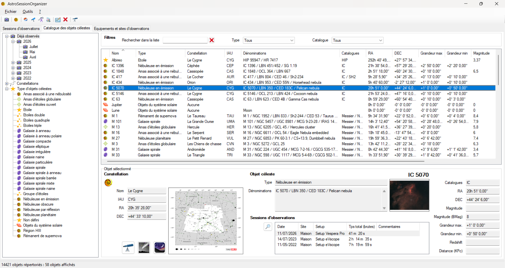

Cet onglet permet d'afficher la liste des objets célestes du catalogue.\
L'affichage de cet onglet est divisé en quatre parties :
- Une liste arborescente comprenant les éléments :
    - ***Déjà observés***\
    Cet élément contient toutes les années/mois correspondant aux objets du catalogue déjà observés.
    - ***Constellations***\
    Cet élément contient la liste des constellations de tous les objets du catalogue.
    - ***Type d'objets célestes***\
    Cet élément contient la liste des types d'objets célestes de tous les objets du catalogue.
- Une [zone de recherche](#zone-de-filtres-des-objets-célestes-affichés) permettant de filtrer la liste des objets célestes.
- Une liste principale contenant la liste des objets célestes en fonction de l'élément sélectionné dans la liste arborescente et du filtre appliqué.
- Un panneau permettant d'afficher le détail de l'objet céleste sélectionné.

> [!TIP]
> La liste des objets célestes peut être triée par ordre croissant ou décroissant en cliquant sur un en-tête de colonne de la liste.

<a href="#sommaire">Retour au sommaire</a>

##### Zone de filtres des objets célestes affichés
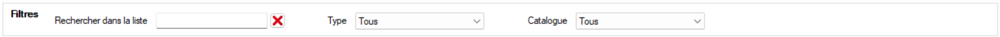

La zone de recherche permettant de filtrer la liste des objets célestes comprend les filtres suivants :
- ***Rechercher dans la liste*** : permet de rechercher sur le nom et/ou les dénominations.
- ***Type*** : permet de filtrer la liste en fonction du type d'objet céleste.
- ***Catalogue*** : permet de filtrer sur un catalogue (Messier, NGC, ...).

<a href="#sommaire">Retour au sommaire</a>

##### Panneau détail d'un objet céleste
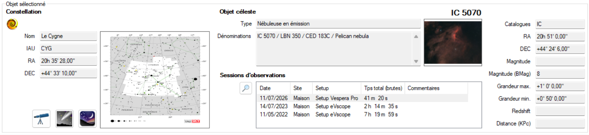

Lorsqu'un objet céleste est sélectionné dans la liste, le panneau de détail de l'objet apparait.\
Ce panneau permet l'affichage des différentes informations concernant l'objet céleste et des sessions d'observations associées, et la possibilité d'effectuer des actions supplémentaires.

Informations affichées :
- Informations de l'objet céleste :
    - Miniature de la constellation de l'objet.
    - Nom.
    - Type.
    - Dénominations secondaires.
    - Constellation.
    - Coordonnées en RA/DEC.
    - Catalogue.
    - Magnitude.
    - Magnitude (BMag).
    - Grandeur maximum.
    - Grandeur minimum.
    - Redshift (décalage au rouge).
    - Distance (KPc).
    - Liste des sessions d'observations sur l'objet céleste.
    - Miniature de la session sélectionnée dans la liste des sessions liées à l'objet.

Actions possibles :
- En cliquant sur la miniature de la constellation, cela permet l'affichage de l'image dans une nouvelle fenêtre.
- En cliquant sur la miniature de la session sélectionnée, cela permet l'affichage de l'image dans une nouvelle fenêtre.
- L'icône  est un raccourci permettant d'afficher la session d'observations concernée directement dans l'onglet ***[Sessions d'observations](#onglet-sessions-dobservations)***.
- L'icône  permet de visualiser l'objet céleste dans le logiciel ***[AstroTargetSelector](https://github.com/Juani005999/AstroTargetSelector)***.\
Lors du clic sur ce bouton, le logiciel ***[AstroTargetSelector](https://github.com/Juani005999/AstroTargetSelector)*** s'ouvre avec l'objet céleste présélectionné.\
Si le logiciel ***[AstroTargetSelector](https://github.com/Juani005999/AstroTargetSelector)*** n'est pas installé sur l'ordinateur, ce bouton est grisé.
- L'icône  permet de visualiser l'objet céleste dans le logiciel ***Cartes du Ciel***.\
Lors du clic sur ce bouton, le logiciel ***Cartes du Ciel*** s'ouvre avec l'objet céleste présélectionné.\
Si le logiciel ***Cartes du Ciel*** n'est pas installé sur l'ordinateur, ce bouton est grisé.
- L'icône  permet de visualiser l'objet céleste dans le logiciel ***Stellarium***.\
Lors du clic sur ce bouton, le logiciel ***Stellarium*** s'ouvre avec l'objet céleste présélectionné.\
Si le logiciel ***Stellarium*** n'est pas installé sur l'ordinateur, ce bouton est grisé.

<a href="#sommaire">Retour au sommaire</a>

#### Onglet Equipements et sites d'observations
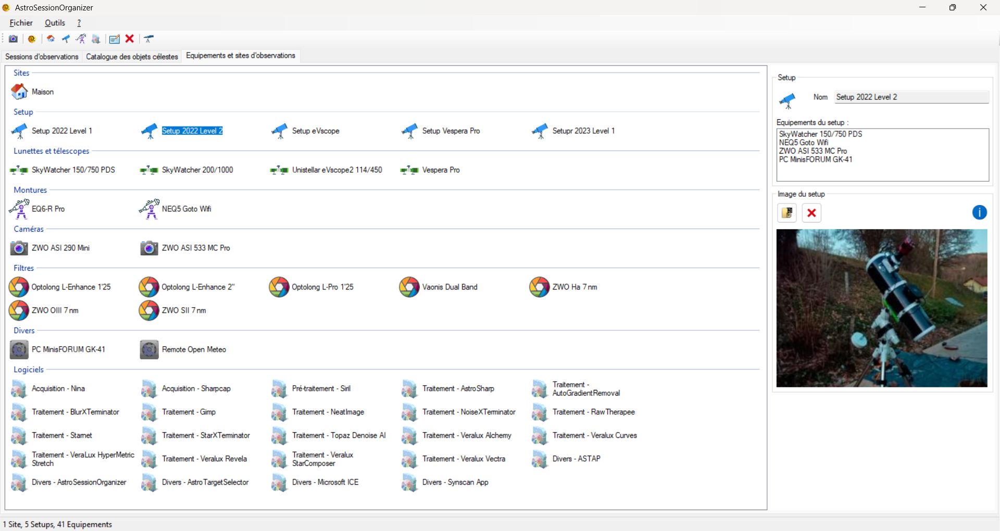

Cet onglet permet l'affichage des sites d'observations et des équipements.\
L'affichage de cet onglet est divisé en deux parties :
- Une liste des sites d'observations et équipements comprenant huit rubriques :
    - ***Sites*** : liste des sites d'observations.
    - ***Setup*** : liste des setups.
    - ***Lunettes et télescopes*** : liste des lunettes et télescopes.
    - ***Montures*** : liste des montures.
    - ***Caméras*** : liste des caméras et appareils photo.
    - ***Filtres*** : liste des filtres.
    - ***Divers*** : liste de matériel divers.
    - ***Logiciels*** : liste des logiciels nécessaires au traitement, à la gestion et à l'acquisition d'images.\
    Cette rubrique comprend quatre catégories de logiciels :
        - ***Acquisition***.
        - ***Pré-traitement***.
        - ***Traitement***.
        - ***Divers***.
- Un panneau permettant d'afficher les propriétés de l'élément sélectionné.

> [!TIP]
> La saisie de setup est optionnelle et permet de regrouper plusieurs équipements afin de faciliter la saisie d'une session d'observations.

<a href="#sommaire">Retour au sommaire</a>

##### Panneau propriétés d'un site ou d'un équipement

Ce panneau permet d'afficher les propriétés de l'élément sélectionné dans la liste.

###### Propriétés d'un site d'observations
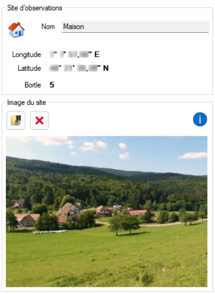

Ce panneau permet l'affichage des propriétés du site sélectionné, et permet également de positionner une image pour le site.

Informations affichées :
- Le Nom.
- Les coordonnées GPS.
- L'indice de Bortle.
- La miniature de l'image du site.

> [!TIP]
> Un clic sur la miniature du site permet l'affichage de l'image dans une nouvelle fenêtre.

<a href="#sommaire">Retour au sommaire</a>

###### Propriétés d'un setup
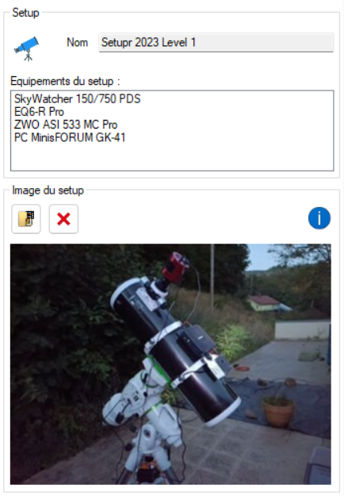

Ce panneau permet l'affichage des propriétés du setup sélectionné, et permet également de positionner une image pour le setup.

Informations affichées :
- Le Nom.
- La liste des équipements constituant le setup.
- La miniature du setup.

> [!TIP]
> La saisie de setup est optionnelle et permet de regrouper plusieurs équipements afin de faciliter la saisie d'une session d'observations.\
La création d'un setup permet également l'affichage d'une miniature dans les Exifs.\
Un clic sur la miniature du setup permet l'affichage de l'image dans une nouvelle fenêtre.

<a href="#sommaire">Retour au sommaire</a>

###### Propriétés d'une lunette / télescope
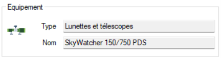

Ce panneau permet l'affichage des propriétés de la lunette ou du télescope sélectionné.

Informations affichées :
- Le Nom.
- Le type d'équipement.

<a href="#sommaire">Retour au sommaire</a>

###### Propriétés d'une monture
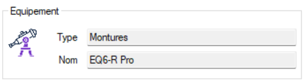

Ce panneau permet l'affichage des propriétés de la monture sélectionnée.

Informations affichées :
- Le Nom.
- Le type d'équipement.

<a href="#sommaire">Retour au sommaire</a>

###### Propriétés d'une caméra
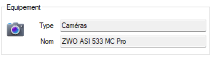

Ce panneau permet l'affichage des propriétés de la caméra sélectionnée.

Informations affichées :
- Le Nom.
- Le type d'équipement.

<a href="#sommaire">Retour au sommaire</a>

###### Propriétés d'un filtre
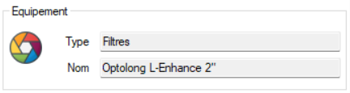

Ce panneau permet l'affichage des propriétés du filtre sélectionné.

Informations affichées :
- Le Nom.
- Le type d'équipement.

<a href="#sommaire">Retour au sommaire</a>

###### Propriétés d'un équipement divers
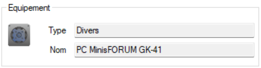

Ce panneau permet l'affichage des propriétés de l'équipement sélectionné.

Informations affichées :
- Le Nom.
- Le type d'équipement.

<a href="#sommaire">Retour au sommaire</a>

###### Propriétés d'un logiciel
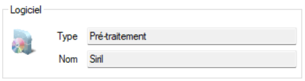

Ce panneau permet l'affichage des propriétés du logiciel sélectionné.

Informations affichées :
- Le Nom.
- Le type de logiciel.

<a href="#sommaire">Retour au sommaire</a>

### Barre de statut
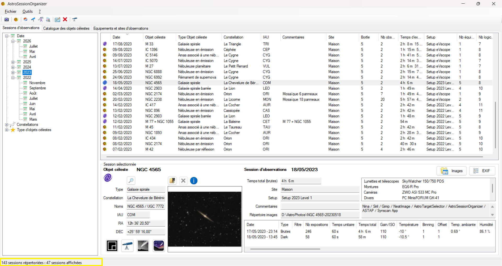

La barre de statut affiche des informations supplémentaires en fonction de l'onglet affiché.

#### Barre de statut de l'onglet Sessions d'observations
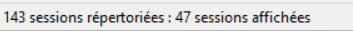

Lorsque l'onglet [Session d'observations](#onglet-sessions-dobservations) est affiché, la barre de statut affiche :
- Le nombre total de sessions d'observations enregistrées.
- Le nombre de sessions d'observations affichées dans la liste des sessions.

> [!NOTE]
> Le nombre de sessions d'observations affichées dans la liste est dépendant de l'élément sélectionné dans la liste arborescente.

<a href="#sommaire">Retour au sommaire</a>

#### Barre de statut de l'onglet Catalogue des objets célestes
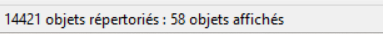

Lorsque l'onglet [Catalogue des objets célestes](#onglet-catalogue-des-objets-célestes) est affiché, la barre de statut affiche :
- Le nombre total d'objets célestes répertoriés dans le catalogue.
- Le nombre d'objets célestes affichés dans la liste des objets.

> [!NOTE]
> Le nombre d'objets célestes affichés dans la liste est dépendant de l'élément sélectionné dans la liste arborescente, et des éléments positionnés dans la zone de filtre.

<a href="#sommaire">Retour au sommaire</a>

#### Barre de statut de l'onglet Equipements et sites d'observations
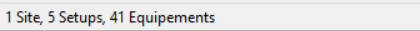

Lorsque l'onglet [Equipements et sites d'observations](#onglet-equipements-et-sites-dobservations) est affiché, la barre de statut affiche :
- Le nombre de sites d'observations enregistrés.
- Le nombre de setups enregistrés.
- Le nombre d'équipements enregistrés.

<a href="#sommaire">Retour au sommaire</a>

## Saisie

### Session d'observations
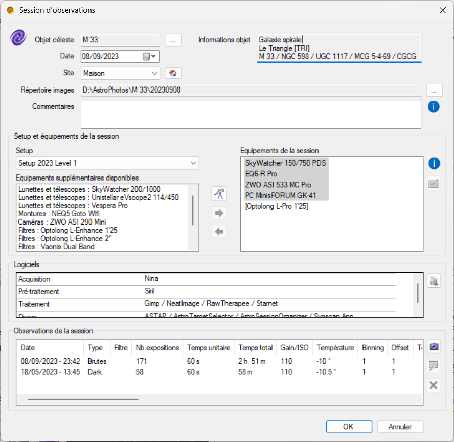

Cette boîte de dialogue permet la saisie ou l'édition d'une session d'observations.

<a href="#sommaire">Retour au sommaire</a>

#### Ajout, modification, suppression d'une session d'observations

Pour ajouter, modifier ou supprimer une session d'observations, vous pouvez le faire :
- Depuis la barre d'outils :
    - Le bouton 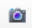 permet d'ouvrir la boîte de dialogue de création d'une nouvelle session.
    - Le bouton 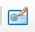 permet de modifier la session sélectionnée.\
    Si aucune session n'est sélectionnée, ce bouton est grisé.
    - Le bouton  permet de supprimer la session sélectionnée.\
    Si aucune session n'est sélectionnée, ce bouton est grisé.

- Depuis le menu contextuel :\
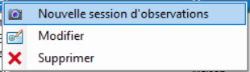\
Dans l'[onglet Sessions d'observations](#onglet-sessions-dobservations), en faisant un clic avec le bouton droit de la souris sur la liste des sessions d'observations, le menu contextuel apparait.\
Ce menu contextuel contient les éléments suivants :
    - ***Nouvelle session d'observations*** : permet d'ouvrir la boîte de dialogue de création d'une nouvelle session.
    - ***Modifier*** : permet de modifier la session sélectionnée.\
    Si aucune session n'est sélectionnée, ce menu est grisé.
    - ***Supprimer*** : permet de supprimer la session sélectionnée.\
    Si aucune session n'est sélectionnée, ce menu est grisé.

<a href="#sommaire">Retour au sommaire</a>

#### Sélection d'un objet céleste

- La zone ci-dessous indique le nom de l'objet céleste actuellement sélectionné pour la session d'observations.\
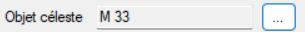
\
Le bouton 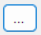 permet d'ouvrir la [boîte de dialogue de sélection d'un objet céleste](#boîte-de-dialogue-de-sélection-dun-objet-céleste).

- La zone ci-dessous indique les informations complémentaires concernant l'objet céleste sélectionné.\
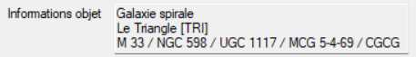\
Ces informations sont :
    - Type de l'objet.
    - Nom et abréviation de la constellation.
    - Dénominations supplémentaires de l'objet.

<a href="#sommaire">Retour au sommaire</a>

##### Boîte de dialogue de sélection d'un objet céleste
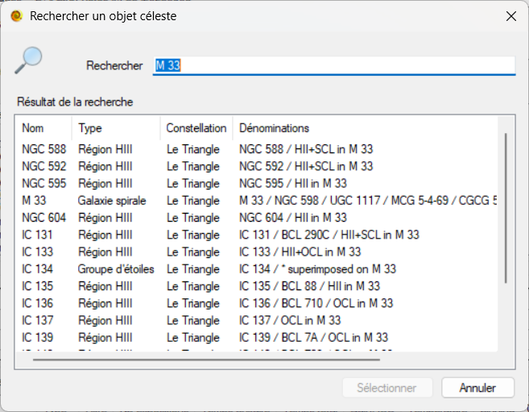

Cette boîte de dialogue permet la sélection d'un objet céleste pour la session.\
Elle est composée de deux zones :
- ***Rechercher*** : zone de saisie permettant de saisir les éléments de recherche.
- ***Résultat de la recherche*** : résultat de la recherche dans le catalogue complet correspondant à la saisie.

> [!NOTE]
> - Le résultat de la recherche s'actualise lors de la saisie dans la zone de recherche.
> - Il est nécessaire de saisir au minimum trois caractères pour lancer la recherche.
> - La recherche s'effectue sur le nom et sur les dénominations.

<a href="#sommaire">Retour au sommaire</a>

#### Date de la session d'observations

Ce champ permet de sélectionner la date de la session d'observations.

<a href="#sommaire">Retour au sommaire</a>

#### Sélection du site d'observations

La zone ci-dessous permet de sélectionner le site d'observations de la session.

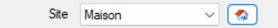

Le bouton 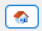 permet d'ouvrir la boîte de dialogue de création d'un nouveau site d'observations.

> [!NOTE]
> Le nouveau site enregistré figurera désormais dans la liste de vos [sites d'observations](#onglet-equipements-et-sites-dobservations). 

<a href="#sommaire">Retour au sommaire</a>

#### Sélection du répertoire contenant les images de la session

La zone ci-dessous permet de sélectionner le répertoire contenant les images de la session.

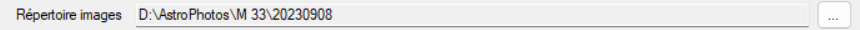

Le bouton  permet de sélectionner le répertoire contenant les images de la session.

> [!TIP]
> À titre personnel, je stocke les images de mes sessions Astro sur un disque dur externe, dans un répertoire nommé `AstroPhotos`.\
Voici le pattern utilisé pour le stockage de mes images :\
`D:\AstroPhotos\[Nom de l'objet]\[Date de la session]\`

<a href="#sommaire">Retour au sommaire</a>

#### Commentaires d'une session

La zone ci-dessous permet de positionner un commentaire pour la session.

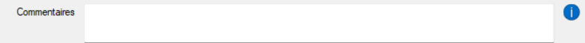

<a href="#sommaire">Retour au sommaire</a>

#### Saisie de l'équipement

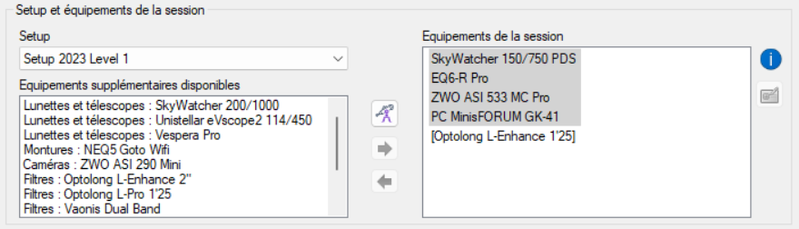

##### Sélection d'un Setup

La zone ci-dessous permet de sélectionner le [Setup](#propriétés-dun-setup).

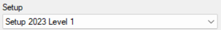

> [!TIP]
> La sélection d'un Setup est **optionnelle**.\
> Vous pouvez sélectionner les équipements manuellement, voire faire un mix d'un Setup plus divers équipements additionnels pour la session.

<a href="#sommaire">Retour au sommaire</a>

##### Sélection d'équipements supplémentaires

La zone ci-dessous permet d'ajouter des équipements additionnels à votre session.

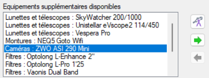

> [!IMPORTANT]
> Les équipements faisant partie du Setup actuellement sélectionné sont retirés de la liste, ainsi que les équipements additionnels déjà sélectionnés.

> [!NOTE]
> Pour ajouter un élément de la liste des équipements supplémentaires à la liste des équipements de la session, sélectionnez l'équipement puis cliquez sur la flèche verte (sens vers la droite), ou double-cliquez sur l'équipement.

> [!TIP]
> Si un nouvel équipement ne figure pas encore dans la liste des équipements, vous pouvez créer un nouvel équipement en cliquant sur le bouton 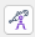.\
> Le nouvel équipement enregistré figurera désormais dans la [liste de vos équipements](#onglet-equipements-et-sites-dobservations).

<a href="#sommaire">Retour au sommaire</a>

##### Liste des équipements de la session

La zone ci-dessous liste les équipements actuellement sélectionnés pour votre session d'observations.

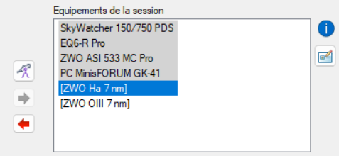

> [!NOTE]
> Pour retirer un élément de la liste des équipements de la session, sélectionnez l'équipement puis cliquez sur la flèche rouge (sens vers la gauche), ou double-cliquez sur l'équipement.

> [!TIP]
> Les équipements faisant partie du Setup sélectionné sont matérialisés par un fond gris.

> [!IMPORTANT]
> Un équipement faisant partie du Setup sélectionné ne peut pas être retiré de la liste.

> [!NOTE]
> Vous pouvez donner un nom différent à l'équipement sélectionné (hormis les équipements faisant partie du Setup sélectionné).\
> Exemple : ***Guidage : SW Evoguide ED50***.\
> Pour cela, sélectionnez l'équipement souhaité, puis cliquez sur le bouton .\
> Pour redonner le nom par défaut, supprimez le texte et laissez la zone vide.

> [!NOTE]
> Lorsque le nom par défaut est utilisé pour un équipement (hormis les équipements faisant partie du Setup sélectionné), il est écrit entre [ ].

<a href="#sommaire">Retour au sommaire</a>

#### Saisie des logiciels

La zone ci-dessous liste les logiciels sélectionnés pour votre session d'observations.

> [!NOTE]
> Vous pouvez ajouter/supprimer des logiciels pour votre session en cliquant sur le bouton .

<a href="#sommaire">Retour au sommaire</a>

##### Ajout/suppression de logiciels à la session

La zone ci-dessous liste les logiciels actuellement sélectionnés pour votre session d'observations.

- La liste de gauche indique la liste des logiciels supplémentaires disponibles.
- La liste de droite indique la liste des logiciels actuellement sélectionnés pour la session.

> [!TIP]
> Les logiciels sont divisés en quatre rubriques :
> - Acquisition.
> - Pré-traitement.
> - Traitement.
> - Divers.

> [!NOTE]
> Pour passer un logiciel d'une liste à l'autre, sélectionnez le logiciel souhaité puis cliquez sur la flèche correspondante.\
> Vous pouvez également double-cliquez sur un logiciel pour le faire passer d'une liste à l'autre.

> [!TIP]
> Si un nouveau logiciel ne figure pas encore dans la liste, vous pouvez en créer un en cliquant sur le bouton .\
> Le nouveau logiciel enregistré figurera désormais dans la [liste de vos équipements](#onglet-equipements-et-sites-dobservations).

<a href="#sommaire">Retour au sommaire</a>

#### Saisie des observations de la session

La zone ci-dessous liste les observations de votre session d'observations.

> [!NOTE]
> Le bouton  permet d'ajouter une nouvelle observation.\
> Le bouton  permet de modifier une observation.\
> Le bouton  permet de supprimer une observation.

<a href="#sommaire">Retour au sommaire</a>

##### Ajout/modification d'une observation

L'ajout ou la modification d'une observation s'effectue grâce à la boîte de dialogue ci-dessous.

Cette boîte de dialogue permet la saisie de toutes les informations relatives à l'observation.

> [!TIP]
> Les informations concernant la Lune sont renseignées automatiquement en fonction de la date et l'heure de l'observation.\
> Vous pouvez cependant modifier ces informations si vous le souhaitez.

> [!NOTE]
> Il est possible de renseigner différents types d'observation :
> - Brutes
> - Darks
> - Bias / Offset
> - Flat

##### Importation des informations d'un fichier Fit

Afin de faciliter la saisie, il est possible d'importer les informations de l'observation depuis un fichier Fit.

- Cliquez sur le bouton ***Ouvrir un fichier*** afin de sélectionner le fichier Fit à partir duquel seront lues les en-têtes (informations de l'observation au format standard).

> [!TIP]
> Personnellement, je sélectionne le fichier ***[MaCible]_stacked.fit***, résultat de l'empilement via le logiciel ***Siril***.

- Cliquez sur le bouton ***Import*** afin de renseigner l'observation avec les informations contenues dans les en-têtes du fichier Fit.

<a href="#sommaire">Retour au sommaire</a>

### Objet céleste

<a href="#sommaire">Retour au sommaire</a>

#### Ajout, modification, suppression d'un objet céleste

Pour ajouter, modifier ou supprimer un objet céleste, vous pouvez le faire :
- Depuis la barre d'outils :
    - Le bouton  permet d'ouvrir la boîte de dialogue de création d'un nouvel objet céleste.
    - Le bouton  permet de modifier l'objet sélectionné.\
    Si aucun objet n'est sélectionné, ce bouton est grisé.
    - Le bouton  permet de supprimer l'objet sélectionné.\
    Si aucun objet n'est sélectionné, ce bouton est grisé.

- Depuis le menu contextuel :\
\
Dans l'[onglet Catalogue des objets célestes](#onglet-catalogue-des-objets-célestes), en faisant un clic avec le bouton droit de la souris sur la liste des objets célestes, le menu contextuel apparait.\
Ce menu contextuel contient les éléments suivants :
    - ***Nouvel objet céleste*** : permet d'ouvrir la boîte de dialogue de création d'un nouvel objet.
    - ***Modifier*** : permet de modifier l'objet sélectionné.\
    Si aucun objet n'est sélectionné, ce menu est grisé.
    - ***Supprimer*** : permet de supprimer l'objet sélectionné.\
    Si aucun objet n'est sélectionné, ce menu est grisé.

> [!IMPORTANT]
> Il n'est pas possible de modifier ou de supprimer un objet céleste du catalogue d'origine.
> Seuls les objets ajoutés manuellement sont modifiables.

<a href="#sommaire">Retour au sommaire</a>

### Site d'observations

<a href="#sommaire">Retour au sommaire</a>

#### Ajout, modification, suppression d'un site d'observations

Pour ajouter, modifier ou supprimer un site d'observations, vous pouvez le faire :
- Depuis la barre d'outils :
    - Le bouton  permet d'ouvrir la boîte de dialogue de création d'un nouveau site d'observations.
    - Le bouton  permet de modifier le site, le setup, l'équipement ou le logiciel sélectionné.\
    Si aucun élément n'est sélectionné, ce bouton est grisé.
    - Le bouton  permet de supprimer le site, le setup, l'équipement ou le logiciel sélectionné.\
    Si aucun élément n'est sélectionné, ce bouton est grisé.

- Depuis le menu contextuel :\
\
Dans l'[onglet Equipements et sites d'observations](#onglet-equipements-et-sites-dobservations), en faisant un clic avec le bouton droit de la souris sur la liste des équipements et sites d'observations, le menu contextuel apparait.\
Ce menu contextuel contient les éléments suivants :
    - ***Nouveau site d'observations*** : permet d'ouvrir la boîte de dialogue de création d'un site d'observations.
    - ***Modifier*** : permet de modifier le site sélectionné.\
    Si aucun élément n'est sélectionné, ce menu est grisé.
    - ***Supprimer*** : permet de supprimer le site sélectionné.\
    Si aucun élément n'est sélectionné, ce menu est grisé.

<a href="#sommaire">Retour au sommaire</a>

### Setup

La création de setup permet de regrouper divers équipements afin de faciliter la saisie de sessions d'observations effectuées avec les mêmes équipements.

> [!NOTE]
> La création de setup est optionnelle.

<a href="#sommaire">Retour au sommaire</a>

#### Ajout, modification, suppression d'un setup

Pour ajouter, modifier ou supprimer un setup, vous pouvez le faire :
- Depuis la barre d'outils :
    - Le bouton  permet d'ouvrir la boîte de dialogue de création d'un nouveau setup.
    - Le bouton  permet de modifier le site, le setup, l'équipement ou le logiciel sélectionné.\
    Si aucun élément n'est sélectionné, ce bouton est grisé.
    - Le bouton  permet de supprimer le site, le setup, l'équipement ou le logiciel sélectionné.\
    Si aucun élément n'est sélectionné, ce bouton est grisé.

- Depuis le menu contextuel :\
\
Dans l'[onglet Equipements et sites d'observations](#onglet-equipements-et-sites-dobservations), en faisant un clic avec le bouton droit de la souris sur la liste des équipements et sites d'observations, le menu contextuel apparait.\
Ce menu contextuel contient les éléments suivants :
    - ***Nouveau setup*** : permet d'ouvrir la boîte de dialogue de création d'un setup.
    - ***Modifier*** : permet de modifier le setup sélectionné.\
    Si aucun élément n'est sélectionné, ce menu est grisé.
    - ***Supprimer*** : permet de supprimer le setup sélectionné.\
    Si aucun élément n'est sélectionné, ce menu est grisé.

<a href="#sommaire">Retour au sommaire</a>

#### Edition d'un setup

La boîte de dialogue d'ajout ou d'édition de setup permet de positionner un nom au setup, et de sélectionner les équipements faisant partie du setup.

> [!NOTE]
> - Pour ajouter un élément de la liste des équipements disponibles à la liste des équipements du setup, sélectionnez l'équipement puis cliquez sur la flèche verte (sens vers la droite), ou double-cliquez sur l'équipement.
> - Pour retirer un élément de la liste des équipements du setup, sélectionnez l'équipement puis cliquez sur la flèche rouge (sens vers la gauche), ou double-cliquez sur l'équipement.

> [!TIP]
> Vous pouvez donner un nom différent à l'équipement ajouté au setup.\
> Exemple : ***Guidage : SW Evoguide ED50***.\
> Pour cela, sélectionnez l'équipement souhaité, puis cliquez sur le bouton .\
> - Pour redonner le nom par défaut, supprimez le texte et laissez la zone vide.
> - Lorsque le nom par défaut est utilisé pour un équipement (hormis les équipements faisant partie du Setup sélectionné), il est écrit entre [ ].

<a href="#sommaire">Retour au sommaire</a>

### Equipement

<a href="#sommaire">Retour au sommaire</a>

#### Ajout, modification, suppression d'un équipement

Pour ajouter, modifier ou supprimer un équipement, vous pouvez le faire :
- Depuis la barre d'outils :
    - Le bouton  permet d'ouvrir la boîte de dialogue de création d'un nouvel équipement.
    - Le bouton  permet de modifier le site, le setup, l'équipement ou le logiciel sélectionné.\
    Si aucun élément n'est sélectionné, ce bouton est grisé.
    - Le bouton  permet de supprimer le site, le setup, l'équipement ou le logiciel sélectionné.\
    Si aucun élément n'est sélectionné, ce bouton est grisé.

- Depuis le menu contextuel :\
\
Dans l'[onglet Equipements et sites d'observations](#onglet-equipements-et-sites-dobservations), en faisant un clic avec le bouton droit de la souris sur la liste des équipements et sites d'observations, le menu contextuel apparait.\
Ce menu contextuel contient les éléments suivants :
    - ***Nouvel équipement*** : permet d'ouvrir la boîte de dialogue de création d'un équipement.
    - ***Modifier*** : permet de modifier l'équipement sélectionné.\
    Si aucun élément n'est sélectionné, ce menu est grisé.
    - ***Supprimer*** : permet de supprimer l'équipement sélectionné.\
    Si aucun élément n'est sélectionné, ce menu est grisé.

<a href="#sommaire">Retour au sommaire</a>

#### Edition d'un équipement

La boîte de dialogue d'ajout ou d'édition d'équipement permet de sélectionner un type d'équipement, et de lui donner un nom.

> [!NOTE]
> Il existe cinq types d'équipements :
>
> 
> - Lunettes et télescopes
> - Montures
> - Caméras
> - Filtres
> - Divers

<a href="#sommaire">Retour au sommaire</a>

### Logiciel

<a href="#sommaire">Retour au sommaire</a>

#### Ajout, modification, suppression d'un logiciel

Pour ajouter, modifier ou supprimer un logiciel, vous pouvez le faire :
- Depuis la barre d'outils :
    - Le bouton  permet d'ouvrir la boîte de dialogue de création d'un nouveau logiciel.
    - Le bouton  permet de modifier le site, le setup, l'équipement ou le logiciel sélectionné.\
    Si aucun élément n'est sélectionné, ce bouton est grisé.
    - Le bouton  permet de supprimer le site, le setup, l'équipement ou le logiciel sélectionné.\
    Si aucun élément n'est sélectionné, ce bouton est grisé.

- Depuis le menu contextuel :\
\
Dans l'[onglet Equipements et sites d'observations](#onglet-equipements-et-sites-dobservations), en faisant un clic avec le bouton droit de la souris sur la liste des équipements et sites d'observations, le menu contextuel apparait.\
Ce menu contextuel contient les éléments suivants :
    - ***Nouveau logiciel*** : permet d'ouvrir la boîte de dialogue de création d'un logiciel.
    - ***Modifier*** : permet de modifier le logiciel sélectionné.\
    Si aucun élément n'est sélectionné, ce menu est grisé.
    - ***Supprimer*** : permet de supprimer le logiciel sélectionné.\
    Si aucun élément n'est sélectionné, ce menu est grisé.

<a href="#sommaire">Retour au sommaire</a>

#### Edition d'un logiciel

La boîte de dialogue d'ajout ou d'édition de logiciel permet de sélectionner un type de logiciel, et de lui donner un nom.

> [!NOTE]
> Il existe quatre types de logiciel :
>
> 
> - Acquisition
> - Pré-traitement
> - Traitement
> - Divers

<a href="#sommaire">Retour au sommaire</a>

## Révisions

| Date | Version | Commentaires |
| --- | --- | --- |
| 20/09/2026 | 0.9.0.2 | <ul><li>Correction du bug sur le catalogue Caldwell manquant. Merci à Eric Beurnaux :)</li></ul> |
| 16/08/2026 | 0.8.2.1 | <ul><li>Exifs : Correction dans l’affichage des colonnes du tableau des observations.</li></ul> |
| 14/05/2023 | 0.8.1.1 | <ul><li>Données météo : Ajout de nouveaux champs pour les observations permettant l’archivage des données de votre station météo (OpenWeather, ROM, ...). Température ambiante, taux d’humidité, pression atmosphérique, point de rosée, FWHM étoiles, qualité du ciel (SQM), température du ciel, brillance du ciel.</li></ul> |
| 19/03/2023 | 0.7.1.1 | <ul><li>Images au format webp : Prise en charge des images au format webp.</li></ul> |
| 05/03/2023 | 0.5.6.2 | <ul><li>Sauvegarde de la base : Remplacement de la boîte de message de succès par une notification icône.</li></ul> |
| 16/02/2023 | 0.5.5.2 | <ul><li>Amélioration des Exifs : Sauvegarde des paramètres des Exifs. Bien vu Gaël Ajinn :)</li></ul> |
| 14/02/2023 | 0.5.4.2 | <ul><li>Amélioration des Exifs : Suppression des informations de Lune pour les observations qui ne sont pas de type ‘brutes’.</li></ul> |
| 14/02/2023 | 0.5.4.1 | <ul><li>Amélioration des Exifs : Possibilité d’ajouter l’image de l’objet céleste en grand au bas de l’Exif (Merci Gaël Ajinn).</li></ul> |
| 11/02/2023 | 0.5.3.4 | <ul><li>Import des infos Fits : Après vérification et validation avec l’équipe SIRIL, lecture du champ DATE-OBS au format UTC (Coordinated Universal Time).</li></ul> |
| 09/02/2023 | 0.5.3.2 | <ul><li>Création de session : Sélection automatique de la nouvelle session dans la liste lors de la création.</li><li>Dénominations : Affichage des dénominations de l’objet céleste dans les Exifs et dans le détail d’une session.</li></ul> |
| 05/02/2023 | 0.5.3.1 | <ul><li>Import des infos Fits : Possibilité de charger dans une observation les données lues avec le Fits reader.</li></ul> |
| 04/02/2023 | 0.5.2.1 | <ul><li>Observations : Actualisation automatique du champ ‘Lune’ en fonction de la date et du lieu de l’observation.</li></ul> |
| 01/02/2023 | 0.4.1.0 | <ul><li>Observations : Ajout du nouveau champ ‘Offset/Brightness’ aux observations.</li><li>Modification de la base de données : Modification de la structure de la table Observations.</li></ul> |
| 01/02/2023 | 0.4.0.3 | <ul><li>FIT Header reader : Correction de la lecture des champs de type COMMENT dans le Header Data Unit.</li><li>Boîte de dialogue Observations : Modifications cosmétiques.</li></ul> |
| 31/01/2023 | 0.4.0.2 | <ul><li>FIT Header reader : Lors de la création/édition d’une observation, un lecteur d’en-tête de fichier fit vous permet de visualiser des données HDU d’une image fit/fits.</li></ul> |
| 31/01/2023 | 0.4.0.1 | <ul><li>Image constellation : Lors de la création/édition d’une session, copie automatique de l’image de la constellation dans le répertoire des images de la session.</li><li>Communication avec [AstroTargetSelector](https://github.com/Juani005999/AstroTargetSelector) : Envoi des dénominations de l’objet.</li><li>Ouverture dans Stellarium : Mise en avant-plan de Stellarium lors de l’affichage d’un objet.</li><li>Ouverture dans Cartes du Ciel : Mise en avant-plan de Cartes du Ciel lors de l’affichage d’un objet.</li><li>Affichage d’une session : Affichage du RA/DEC de l’objet céleste de la session.</li></ul> |
| 28/01/2023 | 0.3.0.1 | <ul><li>Communication avec [AstroTargetSelector](https://github.com/Juani005999/AstroTargetSelector) : Possibilité d’afficher un objet du catalogue afin de visualiser l’évolution de la hauteur dans le ciel et le temps de pose max.</li><li>Modification de la base de données : Mise à jour de la table des objets célestes.</li></ul> |
| 01/01/2023 | 0.1.0.1 | Version initiale. |

<a href="#sommaire">Retour au sommaire</a>

